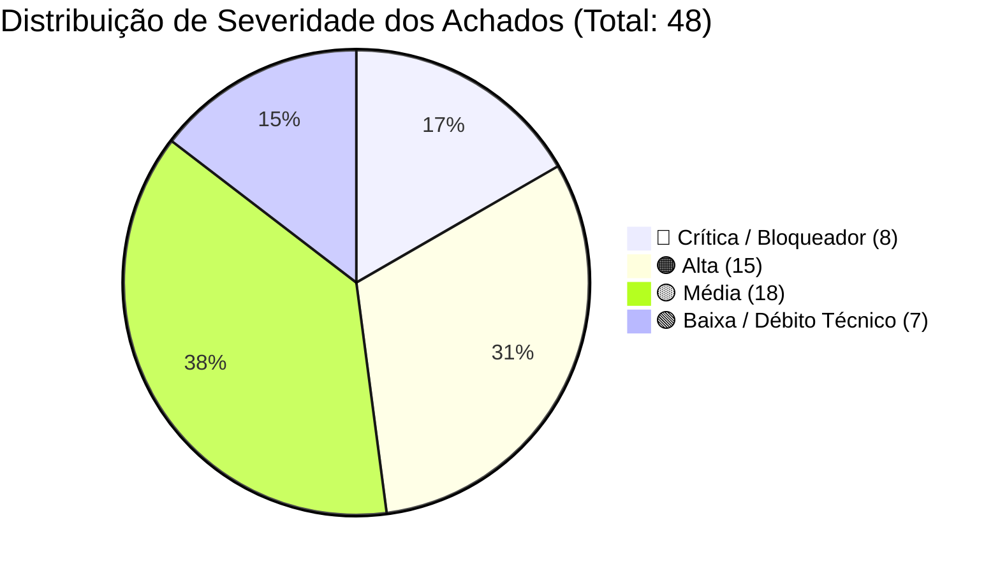

# 🛡️ Diagnóstico de Pré-Lançamento 360º — Elana Academy

**Relatório Oficial de Auditoria Sênior Multidisciplinar**  
**Data da Auditoria:** 22 de Setembro de 2026  
**Status do Projeto:** Pré-Lançamento Comercial  
**Perspectivas Integradas:** Arquitetura & Engenharia, Segurança (AppSec), Banco de Dados, Infraestrutura & DevOps, Qualidade & Testes, Produto & Monetização, UX & Acessibilidade, Privacidade & LGPD, Comunidade & Moderação, Analytics & Métricas.  
**Escopo Auditado:** Aplicação Web/PWA (`/05. App`), Banco de Dados Supabase (Schema, RLS, Triggers e RPCs), Supabase Edge Functions (Deno), Configurações de Deploy (Vercel & Docker/Nginx), Integrações Externas (Stripe, Panda Video, Google Gemini AI) e Conformidade Legal.

---

## 1. 📊 Resumo Executivo

### 1.1. Visão Geral da Maturidade do Sistema
A plataforma **Elana Academy** apresenta uma proposta de valor de altíssima sensibilidade pedagógica e acolhimento humano. O design system, a paleta visual acolhedora, os fluxos da Comunidade (salas temáticas, confessionário anônimo, diário emocional) e o **Quiz Diagnóstico Parental** recém-integrado demonstram um produto com enorme apelo de engajamento para mães, pais e educadores.

Contudo, sob a ótica de engenharia, segurança e prontidão operacional para abertura comercial, **o sistema real diverge criticamente do que é necessário para operar com segurança financeira, jurídica e de dados**. 

Foram identificados **48 achados técnicos**, distribuídos em 10 áreas, incluindo **8 vulnerabilidades/falhas bloqueadoras (🔴 Críticas)** e **15 de alta severidade (🟠 Altas)**. Os pilares de monetização, faturamento, privacidade infantil e segurança do backend possuem brechas ativas que inviabilizam a abertura imediata ao público pagante.

---

### 1.2. Decisão do Launch Gate: **🔴 NÃO RECOMENDADO / BLOQUEADO**

```
┌────────────────────────────────────────────────────────────────────────┐
│                      DECISÃO OFICIAL DE LANÇAMENTO                     │
│                                                                        │
│                🔴 BLOQUEADO PARA LANÇAMENTO COMERCIAL                  │
│                                                                        │
│ O sistema NÃO DEVE ser aberto para tráfego pago ou clientes reais      │
│ até que os 8 bloqueadores de faturamento, segurança e LGPD             │
│ sejam corrigidos e verificados.                                        │
└────────────────────────────────────────────────────────────────────────┘
```

---

### 1.3. Justificativa Clara da Decisão & Os 8 Maiores Bloqueadores (P0)

1. **Bypass Criptográfico Total no Webhook da Stripe ([SEC-01]):**  
   A Edge Function `webhook-checkout` **não valida a assinatura criptográfica da Stripe** (`stripe.webhooks.constructEvent` inexiste). Qualquer pessoa com conhecimento básico de HTTP pode enviar um POST falsificado de `checkout.session.completed` e liberar acesso vitalício a cursos e à comunidade para qualquer usuário sem pagar nada.
2. **Segredo de Webhook Stripe Hardcoded no Repositório ([SEC-02]):**  
   O arquivo `supabase/functions/webhook-checkout/index.ts:10` contém um segredo de webhook em texto claro (`whsec_***`) exposto no repositório Git.
3. **Fraude de Assinatura via RLS no Próprio Perfil ([SEC-03]):**  
   A política de RLS em `profiles` permite que qualquer usuário autenticado altere seu próprio `community_subscription_status` para `'active'` e seu `community_access_expires_at` para `'2099-12-31'` via console do navegador, contornando a mensalidade de R$ 9,90/mês.
4. **Vazamento de PII e Dados de Crianças / Violação Grave LGPD ([PRIV-01] / [SEC-05]):**  
   A política `profiles_select_auth` permite que qualquer usuário registrado leia toda a tabela `profiles`. Além disso, o app salva nomes completos e idades dos filhos em `profiles.family_tag` e o `PublicProfileModal` exibe publicamente essas informações na comunidade, violando diretamente o Art. 14 da LGPD.
5. **Função de Exclusão de Conta Quebrada no Banco / Risco Legal ([PRIV-03] / [DB-02]):**  
   A RPC `delete_own_account()` falha com erro SQL (`column "profile_id" of relation "community_reactions" does not exist`), impedindo que qualquer usuário exerça seu direito de exclusão (Art. 18 da LGPD e Guideline 5.1.1 da Apple App Store).
6. **Links de Venda em Modo de Teste da Stripe ([PROD-01]):**  
   Todos os links de checkout em `src/data/journeysData.ts` apontam para o ambiente Sandbox da Stripe (`buy.stripe.com/test_***`), tornando impossível o faturamento real.
7. **Conteúdo Incompleto Vendido como Disponível ([PROD-02]):**  
   O Módulo 2 da jornada *"Pais Recém-Nascidos"* (a única jornada aberta para venda) possui 17 aulas com vídeos de teste públicos do Google (`ForBiggerJoylikes.mp4`, `Sintel.mp4`) com duração `'- min'`. Além disso, o modal de checkout promete "PDFs de apoio para download", mas existem **zero** materiais anexados nas aulas.
8. **Bug Estrutural no Confessionário Anônimo ([PRIV-02] / [DB-04]):**  
   O trigger do banco define `author_id = NULL` para posts anônimos, mas a query do frontend filtra `.not('author_id', 'is', null)`. Resultado: 100% dos desabafos anônimos desaparecem do feed logo após o envio ou recarga da página.

---

### 1.4. Resumo Quantitativo dos Achados por Severidade



---

## 2. 🗺️ Mapa do Sistema Real

### 2.1. Arquitetura Implementada de Fato

```mermaid
graph TD
    User([Usuário / Mobile & Desktop]) -->|HTTPS / WSS| Vercel[Vercel CDN / Edge]
    Vercel --> SPA[React 18.2 SPA + Vite 5 + TailwindCSS]
    
    subgraph Cliente Browser
        SPA --> AuthCtx[AuthContext - Sessão & Cache Local]
        SPA --> CommCtx[CommunityContext - Feed & Moderação]
        SPA --> JourneysCtx[JourneysContext - Aulas & Progresso]
        SPA --> LocalStorage[localStorage: elana_user_session]
    end

    subgraph Supabase BaaS (us-east-2)
        AuthCtx -->|GoTrue Auth| SupaAuth[Supabase Auth / auth.users]
        AuthCtx -->|REST / PostgREST| SupaDB[(PostgreSQL 15 - public)]
        CommCtx -->|Realtime WebSockets| SupaRealtime[Supabase Realtime]
        JourneysCtx -->|PostgREST| SupaDB
    end

    subgraph Supabase Edge Functions (Deno)
        CommCtx -->|invoke| FnMod[moderate-content]
        AuthCtx -->|invoke| FnEmail[update-user-email]
        Browser -->|PWA Push| FnPush[send-push-notification]
        StripeCheckout -->|Webhook HTTP POST| FnHook[webhook-checkout]
    end

    subgraph Provedores Externos
        FnHook -->|Eventos de Pagamento| Stripe[Stripe Checkout & Billing]
        FnMod -->|Embeddings & Análise| Gemini[Google Gemini 1.5 Flash API]
        FnMod -->|Vetores 768d| PgVector[(pgvector - moderation_rejected_examples)]
        SPA -->|Iframe Player v2| Panda[Panda Video CDN]
        SPA -->|Error Tracking| Sentry[Sentry React SDK - Desativado por DSN ausente]
    end
```

---

### 2.2. Componentes Críticos e Dependências
* **Frontend Web & PWA:** React 18.2 + Vite 5.1 + TailwindCSS 3.4. Roteamento via estado (`activeTab`) com History API (`pushState` e `popstate`).
* **Autenticação:** Supabase GoTrue Auth (e-mail/senha, OTP, Google OAuth). Armazena token JWT sob a chave `sb-mixedzmkjfzumeimfkfz-auth-token`.
* **Banco de Dados Relacional:** Supabase PostgreSQL 15 com extensão `pgvector`. RLS ativo em todas as 16 tabelas principais.
* **Serverless Backend:** 4 Edge Functions Deno em execução:
  - `webhook-checkout`: Provisionamento automático pós-venda.
  - `moderate-content`: Pipeline híbrido (Gemini AI + pgvector) de moderação.
  - `send-push-notification`: WebPush com VAPID.
  - `update-user-email`: Atualização administrativa de e-mail de usuário.
* **Mídia & Streaming:** Panda Video (`player.pandavideo.com.br`) integrado via `<iframe>` e comunicação bidirecional por `postMessage`.

---

### 2.3. Fluxo dos Dados Mais Sensíveis

#### A. Autenticação & Troca de E-mail
* **Login/Registro:** Submete credenciais via `@supabase/supabase-js`. O `AuthContext` hidrata o perfil executando 7 queries sequenciais (`profiles`, `user_badges`, `emotional_checkins`, `user_purchased_journeys`, `user_completed_lessons`, `user_lesson_notes`, `family_members`).
* **Troca de E-mail:** Inicia verificação OTP no cliente e em seguida invoca `update-user-email`. **Vulnerabilidade:** A Edge Function atualiza `auth.users` com `email_confirm: true` confiando apenas no JWT da sessão, sem validar se o e-mail novo foi de fato comprovado no servidor.

#### B. Pagamentos & Provisionamento
* O usuário clica no botão "Começar Jornada" e é redirecionado via `window.open` para um Payment Link da Stripe.
* A Stripe dispara `checkout.session.completed` para a Edge Function `webhook-checkout`.
* **Risco Máximo:** A Edge Function não valida a assinatura criptográfica, permitindo forjamento de compras.

#### C. Dados de Filhos e Menores (LGPD Art. 14)
* Cadastrados em `DashboardPage.tsx` e armazenados em `public.family_members` e replicados como string JSON em `profiles.family_tag`.
* **Vazamento:** Como qualquer usuário autenticado pode ler a tabela `profiles`, os dados de filhos de toda a base de usuários estão acessíveis.

#### D. Desabafos e Diário Emocional
* `emotional_checkins` possui RLS restrito a `profile_id = auth.uid()`.
* Confessionário Anônimo: O banco apaga o `author_id` via trigger, mas o front-end filtra posts com `author_id = null`, fazendo os posts sumirem da listagem.

---

## 3. 📋 Matriz de Escopo x Implementação

| Módulo / Funcionalidade | Status da Implementação | Evidência no Código | Impacto no Lançamento |
| :--- | :---: | :--- | :--- |
| **Catálogo de Jornadas (6 Cursos)** | ⚠️ **DIVERGENTE** | `src/data/journeysData.ts:28-374` | Apenas Módulo 1 de 1 curso tem vídeos reais. Restante são vídeos de teste do Google. |
| **Checkout de Jornadas (Stripe)** | 🔴 **DIVERGENTE** | `src/data/journeysData.ts:40, 102, 164` | URLs configuradas apontam para `buy.stripe.com/test_***`. Nenhuma venda real é processada. |
| **Assinatura da Comunidade (R$ 9,90)** | 🔴 **DIVERGENTE** | `src/data/journeysData.ts:16` e `types/index.ts:143` | URL de assinatura em modo de teste; regra de 90 dias no frontend concede cortesia vitalícia (`journey_courtesy`). |
| **Webhook de Provisionamento** | 🔴 **BLOQUEADOR** | `supabase/functions/webhook-checkout/index.ts:66-83` | Assinatura Stripe ignorada. Qualquer um pode forjar compras e liberar cursos grátis. |
| **Confessionário Anônimo** | 🔴 **DIVERGENTE** | `CommunityContext.tsx:753, 935` | Posts anônimos desaparecem do feed logo após a publicação. |
| **Exclusão de Conta (LGPD Art. 18)** | 🔴 **DIVERGENTE** | `supabase_schema.sql:1449` | Erro SQL `column "profile_id" does not exist`. Exclusão falha 100% das vezes. |
| **Moderação Automática (Gemini + pgvector)** | 🟡 **PARCIAL** | `supabase/functions/moderate-content/index.ts` | Funciona, mas rota pública permite abuso de cota e tabela de exemplos tem RLS aberto para wipe total. |
| **Diário Emocional / Termômetro** | 🟢 **COMPLETO** | `supabase_schema.sql:401`, `CommunityPage.tsx` | RLS blindado (`profile_id = auth.uid()`), histórico persistente e visual acolhedor. |
| **Gamificação, Níveis e Badges** | 🟡 **PARCIAL** | `AuthContext.tsx:1140-1160` | Interface completa, mas XP e Nível são calculados no client e salvos sem validação server-side. |
| **Suporte Emocional / SOS** | 🟠 **DIVERGENTE** | `supabase_schema.sql:677` | RLS permite que o próprio usuário edite `admin_reply` e status do chamado SOS. |
| **Observabilidade e Sentry** | 🔴 **AUSENTE** | `src/lib/sentry.ts:3`, `.env` | `VITE_SENTRY_DSN` não configurada. Zero rastreamento de erros em produção. |
| **Analytics (GA4 / Pixel / UTMs)** | 🔴 **AUSENTE** | `index.html`, `src/App.tsx` | Zero scripts de Google Analytics, Meta Pixel ou persistência de UTMs. Cegueira de marketing. |
| **Testes Automatizados** | 🔴 **AUSENTE** | `package.json:6-11` | 0 testes unitários, 0 testes de integração, 0 testes E2E configurados no projeto. |

---

## 4. 🔍 Achados Detalhados por Área

### 4.1. Arquitetura e Engenharia de Software

#### [ENG-01] Paywall e Aulas Expostas Diretamente no Bundle do Cliente
- **Severidade:** 🟠 Alta | **Status:** CONFIRMADO
- **Evidência:** [`src/data/journeysData.ts:28-374`](file:///Users/vitormardegan/Desktop/Elana/05.%20App/src/data/journeysData.ts#L28-L374) e [`src/pages/ClassroomPage.tsx:425-427`](file:///Users/vitormardegan/Desktop/Elana/05.%20App/src/pages/ClassroomPage.tsx#L425-L427)
- **Impacto:** Todas as URLs de streaming do Panda Video e do Google Storage de todas as 6 jornadas estão em texto claro no JavaScript compilado. Qualquer usuário inspecionando o código ou modificando `purchasedJourneyIds` no `localStorage` tem acesso irrestrito às aulas sem pagar.
- **Causa-Raiz:** Falta de proteção de conteúdo por DRM ou URLs assinadas de expiração curta (`One-Time Tokens`) no backend.
- **Recomendação:** Implementar geração de embed tokens autenticados via Edge Function que valida se o usuário possui registro em `user_purchased_journeys`.
- **Complexidade:** Média (3 a 4 horas).

#### [ENG-02] Encadeamento Sequencial Excessivo na Hidratação de Sessão
- **Severidade:** 🟡 Média | **Status:** CONFIRMADO
- **Evidência:** [`src/context/AuthContext.tsx:472-680`](file:///Users/vitormardegan/Desktop/Elana/05.%20App/src/context/AuthContext.tsx#L472-L680)
- **Impacto:** A função `fetchFullUserProfile` executa 7 requisições `await` lineares ao Supabase (`profiles`, `user_badges`, `emotional_checkins`, `user_purchased_journeys`, `user_completed_lessons`, `user_lesson_notes`, `family_members`). Em conexões 3G/4G, isso acrescenta 2 a 3 segundos de espera no login.
- **Causa-Raiz:** Ausência de paralelização ou de uma RPC Postgres consolidada.
- **Recomendação:** Substituir por `Promise.allSettled` ou criar uma função RPC `get_my_full_profile()` que retorna todo o agregado em um único roundtrip.
- **Complexidade:** Baixa (1 hora).

#### [ENG-03] Falta de Fallback no Player Panda Video
- **Severidade:** 🟡 Média | **Status:** CONFIRMADO
- **Evidência:** [`src/pages/ClassroomPage.tsx:590-605`](file:///Users/vitormardegan/Desktop/Elana/05.%20App/src/pages/ClassroomPage.tsx#L590-L605)
- **Impacto:** Se o aluno estiver em rede restrita, usando adblocker ou o CDN do Panda oscilar, o player vira um retângulo preto sem aviso ou botão de recarregar.
- **Causa-Raiz:** O iframe não possui monitoramento de handshake via `postMessage` nem timeout de carga.
- **Recomendação:** Adicionar timeout de 6 segundos: se nenhum evento `panda_play` ou handshake responder, renderizar aviso amigável com botão "Recarregar aula".
- **Complexidade:** Baixa (45 min).

---

### 4.2. Segurança da Informação e AppSec

#### [SEC-01] Forjamento Irrestrito de Compras via Webhook Stripe sem Validação de Assinatura
- **Severidade:** 🔴 Crítica | **Status:** CONFIRMADO
- **Evidência:** [`supabase/functions/webhook-checkout/index.ts:66-83`](file:///Users/vitormardegan/Desktop/Elana/05.%20App/supabase/functions/webhook-checkout/index.ts#L66-L83)
  ```typescript
  const isStripe = Boolean(stripeSignature || body.object === 'event' || body.type?.startsWith('checkout.') ...);
  if (!isStripe) {
    // Validação de token ocorre APENAS se NÃO for Stripe!
  }
  // Se isStripe === true, o bloco é pulado e a compra é aprovada sem verificar criptografia!
  ```
- **Impacto:** Qualquer pessoa pode emitir requisições HTTP POST simulando compras bem-sucedidas e desbloquear jornadas ou assinaturas ativas para qualquer endereço de e-mail.
- **Causa-Raiz:** Ausência de `stripe.webhooks.constructEvent` com o `STRIPE_WEBHOOK_SECRET`.
- **Recomendação:** Importar o SDK oficial do Stripe e validar rigorosamente o cabeçalho `stripe-signature` contra o raw body da requisição antes de processar qualquer dado.
- **Complexidade:** Baixa (30 min).

#### [SEC-02] Segredo de Webhook Stripe Hardcoded em Código Fonte
- **Severidade:** 🔴 Crítica | **Status:** CONFIRMADO
- **Evidência:** [`supabase/functions/webhook-checkout/index.ts:10`](file:///Users/vitormardegan/Desktop/Elana/05.%20App/supabase/functions/webhook-checkout/index.ts#L10)
  ```typescript
  const webhookSecret = Deno.env.get('WEBHOOK_SECRET') || Deno.env.get('STRIPE_WEBHOOK_SECRET') || 'whsec_***';
  ```
- **Impacto:** A chave privada de webhook está exposta no histórico do repositório.
- **Causa-Raiz:** Configuração de valor de fallback indevida durante testes locais.
- **Recomendação:** Rotacionar imediatamente o segredo no Stripe Dashboard e remover a string do código-fonte, exigindo a variável de ambiente.
- **Complexidade:** Imediata (10 min).

#### [SEC-03] Fraude de Assinatura da Comunidade via Update Direto em `profiles`
- **Severidade:** 🔴 Crítica | **Status:** CONFIRMADO
- **Evidência:** [`supabase_schema.sql:349-352`](file:///Users/vitormardegan/Desktop/Elana/05.%20App/supabase_schema.sql#L349-L352) e [`p1_stripe_subscription_schema.sql:7-11`](file:///Users/vitormardegan/Desktop/Elana/05.%20App/p1_stripe_subscription_schema.sql#L7-L11)
- **Impacto:** Um usuário autenticado pode executar `supabase.from('profiles').update({ community_subscription_status: 'active', community_access_expires_at: '2099-12-31' })` diretamente e obter gratuidade perpétua na assinatura de R$ 9,90/mês.
- **Causa-Raiz:** O trigger `protect_profile_role` monitora apenas a coluna `role`, deixando os campos de faturamento expostos para atualização pelo titular da conta.
- **Recomendação:** Bloquear a alteração de `community_subscription_status`, `community_access_expires_at` e `stripe_customer_id` no trigger `protect_profile_role` para usuários sem papel de admin.
- **Complexidade:** Baixa (20 min).

#### [SEC-04] BOLA / IDOR na Função RPC `vote_on_poll` e RLS Aberto em `community_polls`
- **Severidade:** 🟠 Alta | **Status:** CONFIRMADO
- **Evidência:** [`supabase_schema.sql:864-866, 910-948`](file:///Users/vitormardegan/Desktop/Elana/05.%20App/supabase_schema.sql#L864-L866)
- **Impacto:** A RPC `vote_on_poll` aceita `p_profile_id` arbitrário sem validar `auth.uid() = p_profile_id`, permitindo votar em nome de qualquer usuário. Além disso, a tabela `community_polls` tem política de UPDATE permitindo que qualquer usuário autenticado edite as opções e perguntas da enquete.
- **Causa-Raiz:** Confiança em parâmetros do cliente em função `SECURITY DEFINER` e política permissiva de UPDATE.
- **Recomendação:** Substituir `p_profile_id` por `auth.uid()` na RPC e restringir UPDATE em `community_polls` para administradores.
- **Complexidade:** Baixa (20 min).

#### [SEC-05] RLS Totalmente Aberto em `moderation_rejected_examples` (Risco de Wipe e Poisoning)
- **Severidade:** 🟠 Alta | **Status:** CONFIRMADO
- **Evidência:** [`supabase_schema.sql:1230-1232`](file:///Users/vitormardegan/Desktop/Elana/05.%20App/supabase_schema.sql#L1230-L1232)
  ```sql
  CREATE POLICY "Allow all on moderation_rejected_examples" ON public.moderation_rejected_examples
    FOR ALL USING (true) WITH CHECK (true);
  ```
- **Impacto:** Qualquer usuário (inclusive anônimo) pode deletar toda a base de aprendizado da moderação ou injetar termos falsos, sabotando o classificador por IA da comunidade.
- **Causa-Raiz:** Criação de política aberta durante testes de integração.
- **Recomendação:** Restringir operações na tabela exclusivamente para `public.is_admin()`.
- **Complexidade:** Imediata (5 min).

#### [SEC-06] Bypass de Autenticação / Logins Forjados por Telefone em `LoginPage.tsx`
- **Severidade:** 🟠 Alta | **Status:** CONFIRMADO
- **Evidência:** [`src/pages/LoginPage.tsx:171-191`](file:///Users/vitormardegan/Desktop/Elana/05.%20App/src/pages/LoginPage.tsx#L171-L191)
- **Impacto:** Ao entrar via telefone, o sistema dispara o SMS pelo Supabase, mas nunca requisita nem valida o código OTP, chamando imediatamente a função `login(`${cleanPhone}@elana.app`)`. Qualquer usuário sabendo o telefone de outro consegue se passar visualmente por ele.
- **Causa-Raiz:** Fluxo incompleto de OTP para o método SMS na interface.
- **Recomendação:** Exigir o passo de digitação e validação de OTP via `supabase.auth.verifyOtp` antes de autenticar a sessão.
- **Complexidade:** Média (45 min).

#### [SEC-07] Adulteração de Respostas de Suporte em `sos_tickets`
- **Severidade:** 🟠 Alta | **Status:** CONFIRMADO
- **Evidência:** [`supabase_schema.sql:677-679`](file:///Users/vitormardegan/Desktop/Elana/05.%20App/supabase_schema.sql#L677-L679)
- **Impacto:** Usuários comuns podem atualizar o campo `admin_reply` de seus próprios tickets SOS, forjando mensagens e fingindo terem sido atendidos pela equipe clínica da Elana.
- **Causa-Raiz:** Política de UPDATE permite alterar qualquer coluna do ticket desde que `auth.uid() = profile_id`.
- **Recomendação:** Impedir alteração de `admin_reply` e `status` por usuários sem papel de admin.
- **Complexidade:** Baixa (15 min).

#### [SEC-08] Atualização de E-mail Sem Confirmação no Servidor
- **Severidade:** 🟠 Alta | **Status:** CONFIRMADO
- **Evidência:** [`supabase/functions/update-user-email/index.ts:65-69`](file:///Users/vitormardegan/Desktop/Elana/05.%20App/supabase/functions/update-user-email/index.ts#L65-L69)
- **Impacto:** A função serverless atualiza o e-mail em `auth.users` com `email_confirm: true` baseando-se unicamente no token JWT da sessão, sem exigir confirmação enviada ao novo endereço.
- **Causa-Raiz:** Criação de atalho administrativo para simplificar a troca de e-mail.
- **Recomendação:** Utilizar o fluxo nativo `supabase.auth.updateUser({ email })` que envia confirmação dupla para ambos os endereços.
- **Complexidade:** Baixa (30 min).

#### [SEC-09] Spoofing de Autoria em Posts e Comentários da Comunidade
- **Severidade:** 🟡 Média | **Status:** CONFIRMADO
- **Evidência:** [`supabase_schema.sql:438-445, 471-478, 1294-1302`](file:///Users/vitormardegan/Desktop/Elana/05.%20App/supabase_schema.sql#L438-L445)
- **Impacto:** As políticas de INSERT apenas checam se `auth.uid() IS NOT NULL`, sem validar `WITH CHECK (auth.uid() = author_id)`. Um usuário malicioso pode enviar publicações ou comentários assinados em nome de outro membro ou de um administrador.
- **Causa-Raiz:** Omissão da cláusula de equivalência de autor nas políticas de INSERT.
- **Recomendação:** Adicionar `auth.uid() = author_id` (para posts não anônimos) e `auth.uid() = user_id` (para reações).
- **Complexidade:** Baixa (20 min).

#### [SEC-10] Falhas de Defesa em Profundidade no Content Security Policy (CSP)
- **Severidade:** 🟡 Média | **Status:** CONFIRMADO
- **Evidência:** [`vercel.json:19, 32`](file:///Users/vitormardegan/Desktop/Elana/05.%20App/vercel.json#L19-L32) e [`nginx.conf:16, 19`](file:///Users/vitormardegan/Desktop/Elana/05.%20App/nginx.conf#L16-L19)
- **Impacto:** O CSP permite `'unsafe-inline'` e `'unsafe-eval'` em `script-src` e libera `https://*.supabase.co`, permitindo carregar scripts de buckets públicos. Além disso, `Permissions-Policy: payment=()` desabilita APIs nativas de pagamento do navegador.
- **Causa-Raiz:** Diretivas excessivamente amplas para contornar restrições de build do Vite.
- **Recomendação:** Remover `https://*.supabase.co` de `script-src`, ajustar `payment=(self "https://js.stripe.com")` e adicionar `https://js.stripe.com` nas origens permitidas.
- **Complexidade:** Baixa (15 min).

#### [SEC-11] Consumo Excessivo / Risco de Exaustão de Cota na Edge Function de Moderação
- **Severidade:** 🟡 Média | **Status:** CONFIRMADO
- **Evidência:** [`supabase/functions/moderate-content/index.ts:223, 359-387`](file:///Users/vitormardegan/Desktop/Elana/05.%20App/supabase/functions/moderate-content/index.ts#L223)
- **Impacto:** A ação de moderação pode ser chamada sem cabeçalho `Authorization`, permitindo que bots externos disparem requisições em massa e esgotem a cota da Google Gemini API (Denial of Wallet).
- **Causa-Raiz:** Rota aberta para permitir moderação pré-cadastro ou desabafos sem sessão.
- **Recomendação:** Exigir Bearer Token JWT de usuário autenticado ou implementar rate-limiting rigoroso por IP na Edge Function.
- **Complexidade:** Baixa (20 min).

---

### 4.3. Banco de Dados e Dados

#### [DB-01] Erro de Sintaxe em Trigger de Proteção (`ban_reason` vs `banned_reason`)
- **Severidade:** 🔴 Crítica | **Status:** CONFIRMADO
- **Evidência:** [`supabase_schema.sql:320-330`](file:///Users/vitormardegan/Desktop/Elana/05.%20App/supabase_schema.sql#L320-L330)
- **Impacto:** A função do trigger faz referência a `NEW.ban_reason`, mas a coluna real na tabela `profiles` chama-se `banned_reason`. Qualquer tentativa de banir um usuário ou atualizar o perfil de um usuário banido quebra com erro 500 no Postgres.
- **Causa-Raiz:** Divergência de nomenclatura na evolução do schema.
- **Recomendação:** Corrigir para `NEW.banned_reason := OLD.banned_reason;` na definição da função.
- **Complexidade:** Imediata (5 min).

#### [DB-02] Inconsistência de Coluna na Exclusão de Conta (`delete_own_account`)
- **Severidade:** 🔴 Crítica | **Status:** CONFIRMADO
- **Evidência:** [`supabase_schema.sql:1449`](file:///Users/vitormardegan/Desktop/Elana/05.%20App/supabase_schema.sql#L1449)
- **Impacto:** A função tenta executar `DELETE FROM public.community_reactions WHERE profile_id = current_user_id;`, mas a coluna chama-se `user_id`. A exclusão falha sistematicamente com erro SQL.
- **Causa-Raiz:** Mudança no nome da coluna de chave estrangeira não refletida na stored procedure.
- **Recomendação:** Atualizar a query para `WHERE user_id = current_user_id;`.
- **Complexidade:** Imediata (5 min).

#### [DB-03] Colunas de Assinatura Stripe Ausentes do Schema Mestre
- **Severidade:** 🔴 Crítica | **Status:** CONFIRMADO
- **Evidência:** [`p1_stripe_subscription_schema.sql:7-11`](file:///Users/vitormardegan/Desktop/Elana/05.%20App/p1_stripe_subscription_schema.sql#L7-L11) vs [`supabase_schema.sql`](file:///Users/vitormardegan/Desktop/Elana/05.%20App/supabase_schema.sql)
- **Impacto:** As colunas `stripe_customer_id`, `community_subscription_status`, `community_subscription_id` e `community_access_expires_at` existem apenas no arquivo de migração parcial `p1_stripe_subscription_schema.sql` e foram omitidas de `supabase_schema.sql`. Caso um novo banco seja instanciado, o webhook quebrará imediatamente.
- **Causa-Raiz:** Falta de consolidação das migrações incrementais no schema unificado.
- **Recomendação:** Incorporar as colunas e índices de assinatura diretamente no `supabase_schema.sql`.
- **Complexidade:** Imediata (10 min).

#### [DB-04] Omissão de `onConflict` no Upsert de Badges
- **Severidade:** 🟡 Média | **Status:** CONFIRMADO
- **Evidência:** [`src/context/AuthContext.tsx:602`](file:///Users/vitormardegan/Desktop/Elana/05.%20App/src/context/AuthContext.tsx#L602)
- **Impacto:** O upsert em `user_badges` omite `onConflict: 'profile_id, badge_id'`, disparando erros `duplicate key value violates unique constraint "user_badges_profile_id_badge_id_key"` no console do Supabase quando o usuário revalida conquistas.
- **Causa-Raiz:** Parâmetro `onConflict` esquecido na chamada do Supabase client.
- **Recomendação:** Adicionar `{ onConflict: 'profile_id, badge_id' }` na chamada do método `.upsert()`.
- **Complexidade:** Imediata (5 min).

#### [DB-05] Race Condition no Contador de Votos de Enquetes (`vote_on_poll`)
- **Severidade:** 🟡 Média | **Status:** CONFIRMADO
- **Evidência:** [`supabase_schema.sql:920-940`](file:///Users/vitormardegan/Desktop/Elana/05.%20App/supabase_schema.sql#L920-L940)
- **Impacto:** Em votos simultâneos ou cliques múltiplos, o `INSERT ... ON CONFLICT DO NOTHING` ignora o voto duplicado, mas a query de `UPDATE community_polls SET total_votes = total_votes + 1` roda incondicionalmente fora de transação atômica, inflando a contagem total de votos além da quantidade real de votantes.
- **Causa-Raiz:** Atualização incondicional de contador agregado sem verificação do sucesso do insert individual.
- **Recomendação:** Recontar a partir de `COUNT(*)` em `poll_votes` ou executar o update apenas se o `INSERT` de fato inseriu uma linha (`IF FOUND THEN ...`).
- **Complexidade:** Baixa (15 min).

#### [DB-06] Manipulação Livre de XP e Níveis pelo Cliente
- **Severidade:** 🟡 Média | **Status:** CONFIRMADO
- **Evidência:** [`src/context/AuthContext.tsx:1140-1160`](file:///Users/vitormardegan/Desktop/Elana/05.%20App/src/context/AuthContext.tsx#L1140-L1160)
- **Impacto:** Qualquer usuário pode abrir o DevTools e rodar `supabase.from('profiles').update({ xp: 999999, level_number: 10 })` e atingir o nível máximo sem nunca ter completado uma lição.
- **Causa-Raiz:** Cálculo e persistência de regras de gamificação atribuídos inteiramente ao frontend.
- **Recomendação:** Criar uma RPC `award_xp(amount, reason)` que valida os limites e recalcula o nível no banco.
- **Complexidade:** Média (1 hora).

#### [DB-07] Migrações Não Sincronizadas no Supabase CLI
- **Severidade:** 🟡 Média | **Status:** CONFIRMADO
- **Evidência:** Execução de `supabase migration list` retornou `{"migrations":[]}`.
- **Impacto:** As alterações de banco foram aplicadas via SQL Editor sem controle de versão pelo CLI. Isso impede rollbacks automáticos e gera risco de deriva de ambiente entre staging e produção.
- **Causa-Raiz:** Processo de deploy de banco manual via dashboard web.
- **Recomendação:** Criar migração versionada única contendo o estado consolidado da produção.
- **Complexidade:** Baixa (30 min).

---

### 4.4. Infraestrutura, DevOps e Observabilidade

#### [INF-01] Build em Docker Quebra por Ausência de `ARG` para Variáveis Vite
- **Severidade:** 🔴 Alta | **Status:** CONFIRMADO
- **Evidência:** [`Dockerfile:1-13`](file:///Users/vitormardegan/Desktop/Elana/05.%20App/Dockerfile#L1-L13) e [`.gitignore:17`](file:///Users/vitormardegan/Desktop/Elana/05.%20App/.gitignore#L17)
- **Impacto:** O build do Docker falha ou compila uma versão do app onde as variáveis do Supabase são `undefined`, impossibilitando deploys fora da Vercel (em VPS, AWS ou Kubernetes).
- **Causa-Raiz:** Variáveis `VITE_*` precisam estar disponíveis no momento da compilação estática (`npm run build`).
- **Recomendação:** Declarar `ARG` e `ENV` correspondentes no `Dockerfile`.
- **Complexidade:** Imediata (10 min).

#### [INF-02] Perda Total de Security Headers em Arquivos Estáticos no Nginx
- **Severidade:** 🟠 Alta | **Status:** CONFIRMADO
- **Evidência:** [`nginx.conf:12-29`](file:///Users/vitormardegan/Desktop/Elana/05.%20App/nginx.conf#L12-L29)
- **Impacto:** No Nginx, a presença de `add_header Cache-Control` dentro de `location ~* \.(js|css|...)` anula todos os cabeçalhos de segurança herdados do bloco `server`. Scripts e assets perdem proteções de HSTS, X-Content-Type-Options e CSP quando hospedados em container Nginx.
- **Causa-Raiz:** Comportamento nativo de sobrescrita de herança do Nginx.
- **Recomendação:** Repetir os cabeçalhos essenciais com `always` ou utilizar `include security-headers.conf;`.
- **Complexidade:** Imediata (10 min).

#### [INF-03] Sentry Totalmente Desativado em Produção por Ausência de DSN
- **Severidade:** 🔴 Alta | **Status:** CONFIRMADO
- **Evidência:** [`src/lib/sentry.ts:3-11`](file:///Users/vitormardegan/Desktop/Elana/05.%20App/src/lib/sentry.ts#L3-L11) e [`.env:1-4`](file:///Users/vitormardegan/Desktop/Elana/05.%20App/.env#L1-L4)
- **Impacto:** A variável `VITE_SENTRY_DSN` não está configurada. O SDK desliga-se silenciosamente e nenhuma exceção ou erro de usuário real é reportado ao time de engenharia.
- **Causa-Raiz:** DSN omitida nas variáveis de ambiente da Vercel.
- **Recomendação:** Configurar `VITE_SENTRY_DSN` no painel da Vercel para Production e Preview.
- **Complexidade:** Imediata (5 min).

#### [INF-04] Inexistência de Rota de Health Check
- **Severidade:** 🟡 Média | **Status:** CONFIRMADO
- **Evidência:** [`vercel.json`](file:///Users/vitormardegan/Desktop/Elana/05.%20App/vercel.json) e [`nginx.conf`](file:///Users/vitormardegan/Desktop/Elana/05.%20App/nginx.conf)
- **Impacto:** Probes de uptime e monitoramento (Better Uptime, Pingdom) precisam requisitar a SPA completa, gastando banda e sem checar a saúde das conexões com o Supabase.
- **Causa-Raiz:** Ausência de endpoint leve dedicado.
- **Recomendação:** Adicionar rota `/health` com retorno HTTP 200 rápido e teste de ping no Supabase.
- **Complexidade:** Baixa (20 min).

---

### 4.5. Qualidade de Software e Testes

#### [QA-01] Cobertura de Testes Automatizados é 0% (Zero Testes no Repositório)
- **Severidade:** 🔴 Alta | **Status:** CONFIRMADO
- **Evidência:** [`package.json:6-11`](file:///Users/vitormardegan/Desktop/Elana/05.%20App/package.json#L6-L11)
  ```json
  "scripts": {
    "dev": "vite",
    "build": "tsc && vite build",
    "lint": "eslint .",
    "preview": "vite preview"
  }
  ```
- **Impacto:** Não há `vitest`, `jest`, `playwright` nem `cypress` instalados. Toda regressão de layout, falha em regras de negócio ou erros em webhooks dependem de testes manuais. Qualquer deploy pode quebrar fluxos críticos silenciosamente.
- **Causa-Raiz:** Projeto desenvolvido focado exclusivamente em prototipação e entrega de features visuais.
- **Recomendação:** Instalar `vitest` e implementar suíte mínima de testes de fumaça (Smoke Tests) cobrindo cálculo de permissões, webhook Stripe e formulários de autenticação.
- **Complexidade:** Média (2 a 3 horas).

#### [QA-02] React Error Boundary Deixa Modais e Providers Desprotegidos
- **Severidade:** 🟠 Média | **Status:** CONFIRMADO
- **Evidência:** [`src/App.tsx:329-339, 447-553`](file:///Users/vitormardegan/Desktop/Elana/05.%20App/src/App.tsx#L329-L339)
- **Impacto:** O `<ErrorBoundary>` envolve apenas o conteúdo dentro de `<main>`. Se um erro ocorrer nos Providers (`AuthProvider`, `CommunityProvider`) ou dentro de modais críticos (`CheckoutModal`, `AuthModal`), a tela inteira quebra em branco (White Screen of Death).
- **Causa-Raiz:** Posicionamento interno do ErrorBoundary na árvore de componentes.
- **Recomendação:** Envolver o componente `<App />` raiz com um ErrorBoundary de nível superior em `src/main.tsx`.
- **Complexidade:** Baixa (15 min).

#### [QA-03] Falta de Teste Automatizado de Regressão nos Triggers do Banco
- **Severidade:** 🟡 Média | **Status:** CONFIRMADO
- **Evidência:** Erros de sintaxe em triggers (`ban_reason`) passaram despercebidos até a auditoria estática.
- **Impacto:** Falhas em triggers PostgreSQL só são descobertas em tempo de execução quando um usuário real aciona o evento.
- **Causa-Raiz:** Ausência de suíte de testes de integração SQL (como `pgTAP`).
- **Recomendação:** Criar script Node/TypeScript que executa operações ponta a ponta contra uma base de homologação antes de deploys em produção.
- **Complexidade:** Média (2 horas).

---

### 4.6. Produto, Conteúdo e Negócio

#### [PROD-01] Links de Checkout da Stripe Apontam para Ambiente de Teste
- **Severidade:** 🔴 Crítica | **Status:** CONFIRMADO
- **Evidência:** [`src/data/journeysData.ts:16, 40, 102, 164, 226, 288, 350`](file:///Users/vitormardegan/Desktop/Elana/05.%20App/src/data/journeysData.ts#L16)
  ```typescript
  export const STRIPE_COMMUNITY_CHECKOUT_URL = 'https://buy.stripe.com/test_5kAeWk1rO1q35G0eUU';
  checkoutUrl: 'https://buy.stripe.com/test_cN28wW0nK6Kn1pKdQR'
  ```
- **Impacto:** Nenhuma transação financeira real pode ser completada. Alunos que tentarem comprar verão mensagens de ambiente de teste ou terão cartões reais recusados.
- **Causa-Raiz:** Configuração mantida em modo sandbox durante o desenvolvimento.
- **Recomendação:** Criar os produtos e preços no modo Live do Stripe Dashboard, gerar os Payment Links de produção e atualizar as constantes.
- **Complexidade:** Imediata (15 min).

#### [PROD-02] Conteúdo Incompleto Vendido como Disponível ("Pais Recém-Nascidos")
- **Severidade:** 🔴 Crítica | **Status:** CONFIRMADO
- **Evidência:** [`src/data/journeysData.ts:58-96`](file:///Users/vitormardegan/Desktop/Elana/05.%20App/src/data/journeysData.ts#L58-L96)
- **Impacto:** O Módulo 2 possui 17 aulas com vídeos de teste públicos do Google (`ForBiggerJoylikes.mp4`, `Sintel.mp4`) com duração `'- min'`. A jornada está com `isComingSoon: false`. Clientes que pagarem por esse curso se depararão com vídeos aleatórios de código aberto, gerando alto índice de chargebacks, reclamações no ReclameAqui e pedidos de reembolso imediato.
- **Causa-Raiz:** Aulas liberadas para venda na interface antes do upload dos vídeos finais da Elana no Panda Video.
- **Recomendação:** Subir os vídeos reais do Módulo 2 no Panda Video ou marcar temporariamente o Módulo 2 como "Em Breve" com data estimada de liberação.
- **Complexidade:** Externa / Depende de Conteúdo.

#### [PROD-03] Ausência Total dos PDFs de Apoio Prometidos na Venda
- **Severidade:** 🟠 Alta | **Status:** CONFIRMADO
- **Evidência:** [`src/components/journeys/CheckoutModal.tsx:327`](file:///Users/vitormardegan/Desktop/Elana/05.%20App/src/components/journeys/CheckoutModal.tsx#L327) vs [`src/data/journeysData.ts`](file:///Users/vitormardegan/Desktop/Elana/05.%20App/src/data/journeysData.ts)
- **Impacto:** O modal de vendas promete explicitamente: *"PDFs de apoio para download"*. Contudo, das 134 aulas cadastradas no sistema, **100% delas possuem o array `resources: []` completamente vazio**. Configura propaganda enganosa (Art. 37 do Código de Defesa do Consumidor).
- **Causa-Raiz:** Materiais complementares ainda não foram diagramados nem hospedados.
- **Recomendação:** Remover temporariamente a promessa de PDFs do copy do checkout até que pelo menos 3 guias em PDF estejam prontos para download.
- **Complexidade:** Imediata (10 min).

#### [PROD-04] Quebra da Regra de MRR dos 90 Dias de Comunidade Grátis no Frontend
- **Severidade:** 🟠 Alta | **Status:** CONFIRMADO
- **Evidência:** [`src/types/index.ts:143-146`](file:///Users/vitormardegan/Desktop/Elana/05.%20App/src/types/index.ts#L143-L146)
  ```typescript
  const hasPurchasedJourney = (user.purchasedJourneyIds?.length || 0) > 0;
  if (hasPurchasedJourney) return 'journey_courtesy'; // 🚨 Concede acesso ilimitado sem checar data!
  ```
- **Impacto:** A regra comercial acordada era: *"Quem compra uma jornada ganha 90 dias de comunidade grátis, passando a pagar R$ 9,90/mês depois"*. O frontend concede acesso eterno como `'journey_courtesy'` para qualquer comprador de jornada, anulando a cobrança recorrente da mensalidade e destruindo a conversão de MRR.
- **Causa-Raiz:** Implementação simplificada que não compara `user.communityAccessExpiresAt` com a data atual.
- **Recomendação:** Corrigir a função helper para validar se `new Date(user.communityAccessExpiresAt).getTime() > Date.now()`.
- **Complexidade:** Baixa (20 min).

#### [PROD-05] Webhook Vincula Compras Exclusivamente por E-mail (Risco de Contas Divididas)
- **Severidade:** 🟠 Alta | **Status:** CONFIRMADO
- **Evidência:** [`supabase/functions/webhook-checkout/index.ts:109, 318`](file:///Users/vitormardegan/Desktop/Elana/05.%20App/supabase/functions/webhook-checkout/index.ts#L109)
- **Impacto:** Se o usuário logado com `maria@gmail.com` pagar na Stripe com Apple Pay usando `maria.trabalho@empresa.com`, o webhook provisiona o curso em uma conta nova criada para o e-mail da Stripe. A usuária logada no app continua com a jornada bloqueada e abre chamado de suporte.
- **Causa-Raiz:** O webhook não utiliza `client_reference_id` para amarrar o pagamento ao `user.id` do aluno autenticado.
- **Recomendação:** Passar `client_reference_id = user.id` nas URLs de checkout e priorizar a busca por ID antes de buscar por e-mail.
- **Complexidade:** Baixa (30 min).

#### [PROD-06] Inexistência de URLs de Checkout no Supabase (`journeys.checkout_url`)
- **Severidade:** 🟠 Alta | **Status:** CONFIRMADO
- **Evidência:** [`supabase_schema.sql:505-525`](file:///Users/vitormardegan/Desktop/Elana/05.%20App/supabase_schema.sql#L505-L525)
- **Impacto:** A tabela `public.journeys` no banco não possui a coluna `checkout_url`. Quando os cursos são carregados do banco, `checkoutUrl` fica `undefined` e o modal de vendas desabilita a compra com a mensagem *"Inscrições encerradas"*.
- **Causa-Raiz:** Coluna omitida na criação do schema relacional de jornadas.
- **Recomendação:** Adicionar coluna `checkout_url text` na tabela `journeys`.
- **Complexidade:** Imediata (5 min).

---

### 4.7. UX e Acessibilidade

#### [ACC-01] Falta de Atributos `alt` em Avatares Dinâmicos e Conquistas
- **Severidade:** 🟡 Média | **Status:** CONFIRMADO
- **Evidência:** [`src/components/community/PublicProfileModal.tsx:730`](file:///Users/vitormardegan/Desktop/Elana/05.%20App/src/components/community/PublicProfileModal.tsx#L730) e [`src/components/gamification/BadgeGallery.tsx:48`](file:///Users/vitormardegan/Desktop/Elana/05.%20App/src/components/gamification/BadgeGallery.tsx#L48)
- **Impacto:** Leitores de tela anunciam imagens sem descrição, degradando a acessibilidade para mães e pais com deficiência visual.
- **Causa-Raiz:** Omissão de `alt` descritivo em tags ``.
- **Recomendação:** Adicionar `alt={profile.name ? `Foto de perfil de ${profile.name}` : 'Avatar do membro'}` em todos os elementos visuais.
- **Complexidade:** Baixa (30 min).

#### [ACC-02] Alvos de Toque (Tap Targets) Inferiores a 44x44px no Mobile
- **Severidade:** 🟡 Média | **Status:** CONFIRMADO
- **Evidência:** Botões de ordenação de feed em `CommunityPage.tsx` e botões de velocidade de vídeo em `ClassroomPage.tsx:635` possuem alvos de 28x28px ou 32x32px.
- **Impacto:** Dificuldade de toque para pais segurando bebês no colo ou usando o celular com apenas uma das mãos (violação da WCAG 2.1 Target Size).
- **Causa-Raiz:** Classes Tailwind com dimensões pequenas (`w-7 h-7`, `p-1.5`).
- **Recomendação:** Definir área mínima de clique de `min-h-[44px] min-w-[44px]` em todos os controles interativos touch.
- **Complexidade:** Baixa (45 min).

#### [ACC-03] Contraste Insuficiente em Textos Secundários Slate
- **Severidade:** 🟡 Média | **Status:** CONFIRMADO
- **Evidência:** `text-slate-500` sobre fundo `#101B1E` resulta em contraste de ~3.2:1 (abaixo do limiar de 4.5:1 exigido pela WCAG AA).
- **Impacto:** Textos de datas, contadores e legendas tornam-se ilegíveis em ambientes com claridade ou telas com brilho reduzido.
- **Causa-Raiz:** Uso de escala de cinza muito escura para textos secundários no tema escuro.
- **Recomendação:** Substituir `text-slate-500` por `text-slate-400` em textos informativos importantes.
- **Complexidade:** Baixa (30 min).

#### [ACC-04] Falta de Indicador Visual de Foco (Focus Rings) em Componentes Customizados
- **Severidade:** 🟡 Média | **Status:** CONFIRMADO
- **Evidência:** Seletores customizados de emoji e abas de navegação possuem `outline-none` sem `focus-visible:ring-2`.
- **Impacto:** Navegação por teclado (Tab) torna-se cega em áreas de formulários e interação comunitária.
- **Causa-Raiz:** Reset agressivo de foco para estilização visual.
- **Recomendação:** Garantir `focus-visible:ring-2 focus-visible:ring-[#FF7F5B]` em todos os botões e links navegáveis por teclado.
- **Complexidade:** Baixa (30 min).

---

### 4.8. Privacidade e LGPD

#### [PRIV-01] Vazamento Público de Dados de Menores via `profiles.family_tag`
- **Severidade:** 🔴 Crítica | **Status:** CONFIRMADO
- **Evidência:** [`src/context/AuthContext.tsx:1196`](file:///Users/vitormardegan/Desktop/Elana/05.%20App/src/context/AuthContext.tsx#L1196), [`src/pages/CommunityPage.tsx:691-695`](file:///Users/vitormardegan/Desktop/Elana/05.%20App/src/pages/CommunityPage.tsx#L691-L695) e [`src/components/community/PublicProfileModal.tsx:418-440`](file:///Users/vitormardegan/Desktop/Elana/05.%20App/src/components/community/PublicProfileModal.tsx#L418-L440)
- **Impacto:** Nomes, idades e datas de nascimento de filhos e gestações cadastrados pelos pais são visíveis para qualquer outro membro na comunidade através do modal de perfil público. Infração direta e gravíssima ao Art. 14 da LGPD (Tratamento de Dados Pessoais de Crianças e Adolescentes).
- **Causa-Raiz:** Reutilização de dados familiares privados para compor a interface pública comunitária.
- **Recomendação:** Exibir a seção "Minha Família" exclusivamente para o próprio usuário (`isOwnProfile === true`). Para terceiros, exibir apenas os arquétipos e temas de interesse parental.
- **Complexidade:** Baixa (30 min).

#### [PRIV-02] Quebra do Art. 18 da LGPD por Falha na Função `delete_own_account`
- **Severidade:** 🔴 Crítica | **Status:** CONFIRMADO
- **Evidência:** [`supabase_schema.sql:1449`](file:///Users/vitormardegan/Desktop/Elana/05.%20App/supabase_schema.sql#L1449)
- **Impacto:** Usuários não conseguem exercer seu direito legal de revogação de consentimento e eliminação de seus dados pessoais. Gera passivo de multas pela ANPD e risco de rejeição sumária nas lojas de aplicativos.
- **Causa-Raiz:** Query SQL referenciando coluna inexistente `community_reactions.profile_id`.
- **Recomendação:** Aplicar a correção da procedure com `user_id = current_user_id;`.
- **Complexidade:** Imediata (5 min).

#### [PRIV-03] Cadastro via `LoginPage.tsx` Sem Termos de Uso e Política de Privacidade
- **Severidade:** 🟠 Alta | **Status:** CONFIRMADO
- **Evidência:** [`src/pages/LoginPage.tsx:140-170, 550-610`](file:///Users/vitormardegan/Desktop/Elana/05.%20App/src/pages/LoginPage.tsx#L140-L170) vs [`AuthModal.tsx:97-101`](file:///Users/vitormardegan/Desktop/Elana/05.%20App/src/components/auth/AuthModal.tsx#L97-L101)
- **Impacto:** Usuários que se cadastram pela página `/login` são registrados sem aceite de Termos de Uso e Política de Privacidade, gerando nulidade de consentimento contratual perante o Marco Civil da Internet e a LGPD.
- **Causa-Raiz:** Divergência de implementação entre o modal flutuante e a página de login dedicada.
- **Recomendação:** Incluir o checkbox obrigatório com links para os termos na página `LoginPage.tsx`.
- **Complexidade:** Baixa (20 min).

#### [PRIV-04] Ausência de Consentimento Destacado no Cadastro de Filhos (Art. 14 § 1º LGPD)
- **Severidade:** 🟠 Alta | **Status:** CONFIRMADO
- **Evidência:** [`src/pages/DashboardPage.tsx:1510-1596`](file:///Users/vitormardegan/Desktop/Elana/05.%20App/src/pages/DashboardPage.tsx#L1510-L1596)
- **Impacto:** A coleta de dados sensíveis de menores (nome, data de nascimento, idade gestacional) é realizada sem texto de consentimento específico e em destaque dado por pelo menos um dos pais.
- **Causa-Raiz:** Formulário focado apenas em usabilidade sem consulta aos requisitos legais de proteção de menores.
- **Recomendação:** Inserir termo informativo e consentimento explícito logo acima do botão "+ Adicionar Filho(a)".
- **Complexidade:** Baixa (20 min).

#### [PRIV-05] Limpeza Incompleta de Cache Sensível no Logout
- **Severidade:** 🟡 Média | **Status:** CONFIRMADO
- **Evidência:** [`src/context/AuthContext.tsx:1310-1317`](file:///Users/vitormardegan/Desktop/Elana/05.%20App/src/context/AuthContext.tsx#L1310-L1317)
- **Impacto:** O logout remove apenas `elana_user_session` e `elana_sos_ticket_response`. Chaves como `elana_community_posts_cache`, `elana_confession_count_*` e `elana_quiz_result_*` persistem no navegador, expondo desabafos e diagnósticos parentais em dispositivos compartilhados.
- **Causa-Raiz:** Logout não limpa chaves auxiliares do `localStorage`.
- **Recomendação:** Criar função utilitária `clearAllUserStorage()` que purga todas as chaves prefixadas com `elana_` (preservando apenas `elana_font_size` e `elana_pwa_dismissed`).
- **Complexidade:** Baixa (15 min).

---

### 4.9. Comunidade e Moderação

#### [COM-01] Posts do Confessionário Anônimo Desaparecem Após Reload
- **Severidade:** 🔴 Alta | **Status:** CONFIRMADO
- **Evidência:** [`src/context/CommunityContext.tsx:750-755, 830, 935`](file:///Users/vitormardegan/Desktop/Elana/05.%20App/src/context/CommunityContext.tsx#L750-L755)
- **Impacto:** O confessionário anônimo é a ferramenta mais sensível e atraente da comunidade. Como a query no PostgREST exige `.not('author_id', 'is', null)`, todo post anônimo enviado some do feed na próxima listagem, transmitindo sensação de defeito grave ou censura.
- **Causa-Raiz:** Conflito arquitetural entre a sanitização de segurança do banco (que limpa o `author_id`) e a query do cliente (que supõe que todo post válido possui um `author_id`).
- **Recomendação:** Alterar a query para `.or('not.author_id.is.null,is_anonymous.eq.true')` e ajustar o filtro em memória.
- **Complexidade:** Baixa (20 min).

#### [COM-02] Timeout Curto na Moderação Gemini Causa Queda Frequente para Análise Local
- **Severidade:** 🟡 Média | **Status:** CONFIRMADO
- **Evidência:** [`src/context/CommunityContext.tsx:323-332`](file:///Users/vitormardegan/Desktop/Elana/05.%20App/src/context/CommunityContext.tsx#L323-L332)
- **Impacto:** O cliente possui timeout de 10s via `Promise.race`. Se a chamada paralela do Gemini + embeddings na Edge Function demorar mais de 10s (frequente em cold starts do Deno), o app descarta a análise por IA e recorre apenas à regex local de palavras-chave, deixando passar mom-shaming sutil ou sarcasmos velados.
- **Causa-Raiz:** Cold start de Edge Functions combinado com latência de embedding da Google API.
- **Recomendação:** Manter warm-up na Edge Function e otimizar o prompt de instrução do Gemini para reduzir tokens gerados.
- **Complexidade:** Média (1 hora).

#### [COM-03] Falta de Notificação para Autores Quando Conteúdo é Enviado para Moderação Humana
- **Severidade:** 🟡 Média | **Status:** CONFIRMADO
- **Evidência:** [`src/context/CommunityContext.tsx:340-350`](file:///Users/vitormardegan/Desktop/Elana/05.%20App/src/context/CommunityContext.tsx#L340-L350)
- **Impacto:** Quando uma mensagem é retida por alerta de sensibilidade ou denúncia, o usuário não recebe uma explicação clara com prazo de resposta da curadoria, gerando ansiedade e frustração.
- **Causa-Raiz:** Fluxo de feedback pós-retenção limitado a um toast temporário.
- **Recomendação:** Renderizar aviso persistente na timeline do autor indicando status "Em análise pela curadoria da Elana".
- **Complexidade:** Baixa (40 min).

#### [COM-04] Risco de Envenenamento de Moderação por Injeção de Exemplos Falsos
- **Severidade:** 🟠 Alta | **Status:** CONFIRMADO
- **Evidência:** Relacionado ao achado `[SEC-05]`.
- **Impacto:** A tabela `moderation_rejected_examples` aceita inserts diretos com qualquer vetor, permitindo criar "falsos positivos" que bloqueiam postagens legítimas de membros da comunidade.
- **Causa-Raiz:** Ausência de controle de permissão por RLS.
- **Recomendação:** Bloquear inserts diretos via PostgREST e permitir apenas através da ação administrativa autenticada na Edge Function `moderate-content`.
- **Complexidade:** Imediata (5 min).

---

### 4.10. Analytics, Rastreamento e Métricas

#### [ANA-01] Ausência de Google Analytics 4 (GA4) / PostHog
- **Severidade:** 🔴 Alta | **Status:** CONFIRMADO
- **Evidência:** [`index.html:1-85`](file:///Users/vitormardegan/Desktop/Elana/05.%20App/index.html#L1-L85) e busca em todo o diretório `src/`.
- **Impacto:** Nenhum evento de tráfego, visualização de página, retenção de usuários ou funil de navegação é registrado. O time não saberá quantos visitantes chegaram à página inicial, quantos tentaram comprar ou onde abandonaram o fluxo.
- **Causa-Raiz:** Tags de medição omitidas durante a construção.
- **Recomendação:** Adicionar script do GA4 (ou PostHog com consentimento LGPD) no `index.html` com suporte a PageViews da SPA.
- **Complexidade:** Baixa (30 min).

#### [ANA-02] Ausência de Meta Pixel (Facebook Ads) e Conversions API
- **Severidade:** 🔴 Alta | **Status:** CONFIRMADO
- **Evidência:** Nenhuma menção a `fbq` ou Pixel ID encontrada em todo o código.
- **Impacto:** Campanhas de tráfego pago no Instagram/Facebook rodarão cegas, impossibilitando otimização por conversão (Purchase / InitiateCheckout) e encarecendo drasticamente o custo por aquisição (CAC).
- **Causa-Raiz:** Integração de marketing adiada para a fase de lançamento.
- **Recomendação:** Integrar o Meta Pixel no `index.html` e disparar eventos `InitiateCheckout` ao abrir os links de compra.
- **Complexidade:** Baixa (30 min).

#### [ANA-03] Falta de Captura e Persistência de Parâmetros UTM no Fluxo de Compra
- **Severidade:** 🟠 Alta | **Status:** CONFIRMADO
- **Evidência:** [`src/pages/DashboardPage.tsx:440-446`](file:///Users/vitormardegan/Desktop/Elana/05.%20App/src/pages/DashboardPage.tsx#L440-L446) e [`src/components/journeys/CheckoutModal.tsx:48-58`](file:///Users/vitormardegan/Desktop/Elana/05.%20App/src/components/journeys/CheckoutModal.tsx#L48-L58)
- **Impacto:** Se o usuário acessa o app via link patrocinado com `utm_source=instagram&utm_campaign=lancamento`, esses parâmetros são perdidos na navegação interna e **não são repassados aos links de checkout da Stripe**. O painel de anúncios não registrará qual anúncio ou criativo gerou a venda.
- **Causa-Raiz:** Os links da Stripe são instanciados como strings estáticas sem anexar a query string da URL corrente.
- **Recomendação:** Capturar UTMs no carregamento da página, salvar em `sessionStorage` e concatenar automaticamente nos links de checkout da Stripe.
- **Complexidade:** Baixa (30 min).

---

## 5. ⚠️ Riscos e Incertezas Não Verificáveis

| Item | Risco / Incerteza | Por que não é verificável estaticamente? | Ação Necessária para Validação |
| :--- | :--- | :--- | :--- |
| **Secrets da Stripe em Produção** | Se `STRIPE_WEBHOOK_SECRET` e `STRIPE_SECRET_KEY` de produção estão cadastrados corretamente no Supabase. | Secrets das Edge Functions residem no cofre seguro do Supabase e não são retornados pelo CLI. | O administrador deve verificar via `supabase secrets list` no terminal local ou painel web. |
| **Limites de Cota da Gemini API** | Se a chave configurada no Supabase possui limite de requisições ou cobrança ativa na Google Cloud. | Acesso somente via console do Google Cloud Platform. | Validar no console GCP se a API Gemini 1.5 Flash está com faturamento ativo e sem bloqueio de cota. |
| **Taxa de Entrega de WebPush (VAPID)** | Se o par de chaves VAPID configurado no Supabase corresponde à chave pública VITE do cliente. | A chave privada VAPID não está no repositório. | Testar o envio de uma notificação push real para um dispositivo móvel no painel administrativo. |
| **Configuração de Domínio e DNS da Stripe** | Se o webhook da Stripe em produção está cadastrado e ativo para escutar a URL do Supabase. | Requer acesso com login ao Stripe Dashboard do cliente. | Acessar `dashboard.stripe.com -> Desenvolvedores -> Webhooks` e confirmar o endpoint `https://mixedzmkjfzumeimfkfz.supabase.co/functions/v1/webhook-checkout`. |

---

## 6. 💡 Oportunidades de Melhoria (Roadmap Pós-Lançamento)

1. **DRM & Streaming Protegido no Panda Video:**  
   Substituir iframes com URLs públicas por tokens assinados de sessão única (`Signed URLs` / `One-Time Tokens`) com expiração de 15 minutos, impedindo o download ou compartilhamento indevido das aulas gravadas.
2. **Arquitetura Modular de Estado com Zustand ou Jotai:**  
   O `CommunityContext.tsx` e o `AuthContext.tsx` atingiram tamanhos expressivos (>1.800 linhas), re-renderizando árvores inteiras de componentes a cada batimento de coração ou check-in. Uma migração gradual para store atômica reduzirá drasticamente o consumo de bateria no celular.
3. **PWA Offline Mode para Áudios das Aulas:**  
   Como a plataforma oferece o recurso "Ouvir aula como áudio", permitir o download offline de áudios dentro da cota do PWA para mães ouvirem durante deslocamentos ou amamentação sem internet.
4. **Gamificação com Recompensas Práticas na Comunidade:**  
   Conectar os níveis de XP (ex: Raiz, Florescer) a benefícios práticos, como selos de mentora, acesso a encontros ao vivo exclusivos ou prioridade de resposta nas salas de acolhimento.

---

## 7. 🚦 Checklist de Lançamento (Launch Gates)

### 🔴 7.1. Obrigatórios Antes de Abrir para Usuários Reais (Go / No-Go)
- [ ] **[SEC-01 / SEC-02]** Corrigir Edge Function `webhook-checkout`: implementar validação de assinatura `stripe.webhooks.constructEvent`, remover segredo hardcoded e rotacionar chave no Stripe Dashboard.
- [ ] **[SEC-03]** Blindar trigger `protect_profile_role` no PostgreSQL para impedir que usuários alterem `community_subscription_status` e `community_access_expires_at`.
- [ ] **[PRIV-01]** Desativar exibição pública de nomes e dados de crianças no `PublicProfileModal.tsx` e remover `profiles.family_tag` legível por terceiros.
- [ ] **[PRIV-02 / COM-01]** Corrigir query de posts em `CommunityContext.tsx` para recuperar posts do Confessionário Anônimo (`is_anonymous = true`).
- [ ] **[PRIV-03 / DB-02]** Corrigir bug SQL na procedure `delete_own_account()` (`WHERE user_id = current_user_id`).
- [ ] **[DB-01]** Corrigir erro de digitação `ban_reason` para `banned_reason` no trigger `protect_profile_role`.
- [ ] **[SEC-05]** Fechar RLS da tabela `moderation_rejected_examples` para `public.is_admin()`.
- [ ] **[SEC-04]** Blindar RPC `vote_on_poll` para usar `auth.uid()` e fechar UPDATE em `community_polls`.
- [ ] **[PROD-01]** Substituir Payment Links da Stripe de teste (`buy.stripe.com/test_***`) pelos links reais de Produção em `src/data/journeysData.ts`.
- [ ] **[PROD-02]** Definir estratégia de conteúdo para o Módulo 2 de "Pais Recém-Nascidos" (subir vídeos reais no Panda Video ou marcar temporariamente como "Em Breve").
- [ ] **[PROD-03]** Ajustar o texto do checkout retirando a promessa de "PDFs de apoio" até que os arquivos estejam produzidos e anexados.
- [ ] **[PROD-04]** Corrigir a verificação dos 90 dias de comunidade grátis em `types/index.ts` para respeitar a data de expiração.
- [ ] **[PRIV-03]** Adicionar checkbox de aceite de Termos de Uso e Política de Privacidade em `LoginPage.tsx`.
- [ ] **[PRIV-04]** Adicionar termo de consentimento parental (Art. 14 LGPD) no cadastro de filhos em `DashboardPage.tsx`.

---

### 🟠 7.2. Fortemente Recomendados (Primeiras 24-48h de Operação)
- [ ] **[OBS-01]** Configurar `VITE_SENTRY_DSN` no painel da Vercel para monitoramento em tempo real de erros de runtime.
- [ ] **[ANA-01 / ANA-02 / ANA-03]** Injetar scripts do Google Analytics 4, Meta Pixel e script de persistência de parâmetros UTM.
- [ ] **[SEC-06]** Corrigir fluxo de login por telefone para exigir validação de OTP antes de autenticar a sessão.
- [ ] **[SEC-07]** Proteger o campo `admin_reply` na tabela `sos_tickets`.
- [ ] **[SEC-08]** Migrar a troca de e-mail para o fluxo padrão de confirmação nativa do Supabase Auth.
- [ ] **[INF-01]** Atualizar o `Dockerfile` com argumentos `ARG` para variáveis Vite.
- [ ] **[INF-02]** Corrigir herança de security headers no `nginx.conf`.
- [ ] **[QA-02]** Posicionar `<ErrorBoundary>` de nível global em volta da aplicação inteira.

---

### 🟡 7.3. Pós-Lançamento Imediato (Primeiras 72h a 1ª Semana)
- [ ] **[QA-01]** Configurar `vitest` e criar testes de fumaça essenciais para autenticação e webhooks.
- [ ] **[SEC-14]** Implementar One-Time Tokens no Panda Video para proteção contra download das vídeo-aulas.
- [ ] **[DB-06]** Migrar o cálculo de XP e níveis para uma RPC server-side atômica.
- [ ] **[ACC-01 / ACC-02 / ACC-03]** Aplicar melhorias de acessibilidade mobile (tap targets 44px, alt em imagens e contraste).
- [ ] **[ENG-02]** Consolidar a hidratação de perfil em chamada paralela ou RPC unificada.

---

## 8. 🎯 Plano de Ação Priorizado de Remediação (Fase 2)

O plano de ação está dividido em 3 ondas de execução para maximizar o impacto com segurança e agilidade:

```
┌────────────────────────────────────────────────────────────────────────┐
│ ONDA 1: BLINDAGEM DE SEGURANÇA, FATURAMENTO E BANCO (Tempo: ~2 horas)  │
│ 1. Patch SQL no Supabase: RLS, Triggers de faturamento, delete_own_    │
│    account, vote_on_poll, moderation_examples e índice Stripe.         │
│ 2. Atualizar Edge Function webhook-checkout com assinatura Stripe.     │
│ 3. Trocar links de teste da Stripe para Produção em journeysData.ts.   │
│ 4. Corrigir cálculo de 90 dias e checagem de compra no frontend.       │
└────────────────────────────────────────────────────────────────────────┘
                                    │
                                    ▼
┌────────────────────────────────────────────────────────────────────────┐
│ ONDA 2: LGPD, PRIVACIDADE INFANTIL E COMUNIDADE (Tempo: ~1.5 horas)    │
│ 1. Ocultar dados de filhos de terceiros no PublicProfileModal.         │
│ 2. Corrigir query de posts anônimos no CommunityContext.               │
│ 3. Adicionar checkbox de Termos de Uso em LoginPage.tsx.               │
│ 4. Adicionar aviso de consentimento Art. 14 no cadastro de filhos.     │
│ 5. Ajustar promessa de PDFs no CheckoutModal e copy de aulas.          │
└────────────────────────────────────────────────────────────────────────┘
                                    │
                                    ▼
┌────────────────────────────────────────────────────────────────────────┐
│ ONDA 3: INFRA, OBSERVABILIDADE E MARKETING (Tempo: ~1 hora)            │
│ 1. Ativar Sentry DSN na Vercel e ErrorBoundary global.                 │
│ 2. Injetar scripts de GA4, Meta Pixel e rastreador de UTMs.            │
│ 3. Corrigir Dockerfile e cabeçalhos Nginx.                             │
│ 4. Teste de fumaça ponta a ponta e verificação final de deploy.        │
└────────────────────────────────────────────────────────────────────────┘
```

---

## 9. ❓ Itens Pendentes e Decisões em Aberto com o Usuário

Antes de avançar para a execução da Fase 2 (Correções e Fixes), as seguintes definições comerciais e de infraestrutura precisam ser alinhadas:

1. **Definição dos Vídeos do Módulo 2 ("Pais Recém-Nascidos"):**  
   Os vídeos reais do Módulo 2 já estão prontos para envio ao Panda Video, ou você prefere que marquemos temporariamente o Módulo 2 como *"Em Breve (Liberação em 7 dias)"* enquanto o Módulo 1 funciona como degustação completa?
2. **Links de Produção da Stripe:**  
   Você já gerou os Payment Links em modo **Live** (produção) no seu painel da Stripe para as jornadas e para a Comunidade (R$ 9,90/mês)? Se sim, podemos inseri-los no arquivo de dados.
3. **Segredo do Webhook na Stripe:**  
   No painel da Stripe (modo Live), já foi cadastrado o endpoint `https://mixedzmkjfzumeimfkfz.supabase.co/functions/v1/webhook-checkout` escutando os eventos `checkout.session.completed`, `invoice.payment_succeeded` e `customer.subscription.deleted`? O segredo de assinatura gerado (`whsec_***`) precisará ser configurado no Supabase Secrets.
4. **Copy do Checkout vs. PDFs de Apoio:**  
   Como ainda não há PDFs diagramados para download imediato, você autoriza removermos a menção de *"PDFs de apoio para download"* do modal de checkout para manter total transparência com os compradores?

---
*Relatório concluído com base estrita na inspeção dos arquivos locais do projeto, schemas do banco Supabase e logs de execução. Nenhuma alteração foi gravada no código fonte ou banco de dados nesta etapa.*
