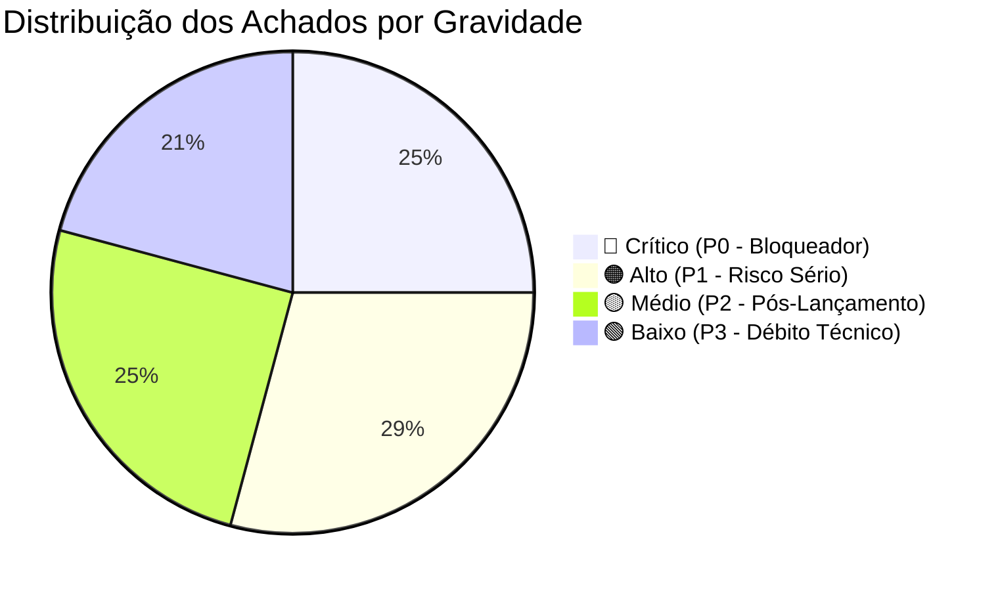

# 🛡️ Diagnóstico de Pré-Lançamento — Elana Academy
**Relatório Oficial de Auditoria Sênior de Engenharia, Segurança, Dados e Produto**  
**Data da Auditoria:** 18 de Setembro de 2026  
**Status do Projeto:** Pré-Lançamento Comercial  
**Escopo Auditado:** Aplicação Web/PWA (`05. App`), Banco de Dados & RLS Supabase, Edge Functions Deno, Políticas de Privacidade/LGPD e Documentação Institucional (`01. Institucional` a `04. Quizz`).

---

## 1. 📊 Resumo Executivo

A aplicação **Elana Academy** apresenta um trabalho excepcional de branding, identidade visual acolhedora, sensibilidade no tratamento dos temas parentais e robustez de componentes UI. A experiência do usuário (UX) nas áreas concluídas transmite calor, respeito e profissionalismo.

Contudo, sob a ótica de engenharia de software sênior e conformidade regulatória, **o produto ainda NÃO está pronto para abertura comercial ao público geral**. A nota de prontidão técnica atual é:

### 🎯 Nota de Prontidão: **6.2 / 10**

O projeto possui **bloqueadores críticos (P0)** de segurança, brechas de LGPD (exposição pública de dados sensíveis de leads e de saúde mental) e um funil de monetização desconectado das plataformas reais de checkout. Abrir as vendas no estado presente resultaria em perdas financeiras, vulnerabilidade a invasões e passivo jurídico.



---

### 🚨 Os 5 Maiores Riscos Bloqueadores do Lançamento Hoje

1. **Exposição Pública de Leads e Dados Emocionais Sensíveis (LGPD):**  
   A tabela `journey_interests` possui política `SELECT USING (true)`, permitindo que qualquer pessoa na internet extraia nome, e-mail e telefone de todos os interessados. Além disso, a tabela `destaques` permite escrita pública total (`FOR ALL USING (true)`), permitindo que bots excluam ou adulterem os stories na tela inicial.
2. **Edge Function de Checkout Aberta e Vulnerável:**  
   O segredo `WEBHOOK_SECRET` não está configurado no Supabase. O código atual da Edge Function possui uma condição que avalia como válida qualquer requisição caso a variável de ambiente não esteja preenchida, permitindo que qualquer pessoa injete eventos de compra falsa ou cancele pedidos reais.
3. **Inexistência de Checkout Comercial Real & Paywall Dessincronizado:**  
   O botão de compra atual opera como um mock (`setTimeout(1200ms)`) e tenta gravar na tabela `user_purchased_journeys`, cuja escrita foi corretamente restrita a administradores. Como resultado, compras no ambiente de produção falham silenciosamente para clientes normais no banco de dados.
4. **Vulnerabilidade de Exclusão Arbitrária no Storage Supabase (`user-media`):**  
   As políticas de `UPDATE` e `DELETE` no bucket `user-media` verificam apenas se o usuário está autenticado (`auth.uid() IS NOT NULL`), sem checar se ele é o proprietário do arquivo. Qualquer usuário cadastrado pode deletar ou substituir avatares, fotos de posts e arquivos de outros usuários.
5. **Auto-Desbanimento de Membros Abusivos na Comunidade:**  
   A trava `protect_profile_role` no banco protege exclusivamente a coluna `role`. A política de atualização de perfil permite que qualquer usuário banido envie uma requisição alterando `is_banned` de volta para `false`, neutralizando a moderação da equipe.

---

## 2. 🔍 Achados Detalhados por Área

### 2.1. 🔴 Nível Crítico (P0) — Bloqueadores de Lançamento

#### [P0-1] Exposição Pública Irrestrita de Dados de Contato e Leads (`journey_interests`)
* **Evidência no Código:** [`supabase_schema.sql:1117-1118`](file:///Users/vitormardegan/Desktop/Elana/05.%20App/supabase_schema.sql#L1117-L1118)
  ```sql
  CREATE POLICY "Allow public select on journey_interests" 
    ON public.journey_interests FOR SELECT USING (true);
  ```
* **Impacto:** A tabela armazena `user_name`, `user_email`, `user_phone` e `journey_id`. Com a política `USING (true)`, qualquer cliente HTTP utilizando a chave anônima pública pode listar a base de leads e clientes potenciais da empresa. Isso configura infração direta aos Artigos 6º e 46 da LGPD, sujeita a denúncia na ANPD.
* **Correção:** Restringir o `SELECT` exclusivamente a administradores (`public.is_admin()`).

#### [P0-2] Falha de Autenticação Crítica no Webhook de Vendas (`webhook-checkout`)
* **Evidência no Código:** [`supabase/functions/webhook-checkout/index.ts:10, 73`](file:///Users/vitormardegan/Desktop/Elana/05.%20App/supabase/functions/webhook-checkout/index.ts#L10)
  ```typescript
  const webhookSecret = Deno.env.get('WEBHOOK_SECRET') || '';
  // ...
  if (webhookSecret && providedToken !== webhookSecret) { ... }
  ```
* **Impacto:** Nos segredos do Supabase remoto, a variável `WEBHOOK_SECRET` não está definida. Quando `webhookSecret` é vazio, a condição `if (webhookSecret && ...)` é avaliada como `false`, ignorando o teste de segurança. Qualquer atacante pode disparar requisições `POST` forjadas com status `approved` e liberar todas as jornadas pagas gratuitamente, ou enviar status `refunded` e revogar o acesso de alunos legítimos.
* **Correção:** Exigir obrigatoriamente que `webhookSecret` esteja configurado e recusar qualquer requisição se a variável de ambiente estiver ausente ou se o token não corresponder.

#### [P0-3] Modificação e Exclusão Pública Aberta na Tabela de Destaques (`destaques`)
* **Evidência no Código:** [`supabase_schema.sql:1094-1096`](file:///Users/vitormardegan/Desktop/Elana/05.%20App/supabase_schema.sql#L1094-L1096)
  ```sql
  CREATE POLICY "Allow public all on destaques" ON public.destaques
    FOR ALL USING (true) WITH CHECK (true);
  ```
* **Impacto:** A política `FOR ALL USING (true)` concede permissão anônima irrestrita para `INSERT`, `UPDATE` e `DELETE`. Qualquer pessoa na internet pode apagar todos os stories da página inicial da plataforma ou injetar mídias impróprias e links maliciosos.
* **Correção:** Manter `SELECT` público, mas restringir `INSERT`, `UPDATE` e `DELETE` estritamente para `public.is_admin()`.

#### [P0-4] Manipulação Arbitrária de Arquivos no Supabase Storage (`user-media`)
* **Evidência no Código:** [`supabase_schema.sql:688-694`](file:///Users/vitormardegan/Desktop/Elana/05.%20App/supabase_schema.sql#L688-L694)
  ```sql
  CREATE POLICY "storage_update_auth" ON storage.objects FOR UPDATE
    USING (bucket_id = 'user-media' AND auth.uid() IS NOT NULL);
  CREATE POLICY "storage_delete_auth" ON storage.objects FOR DELETE
    USING (bucket_id = 'user-media' AND auth.uid() IS NOT NULL);
  ```
* **Impacto:** Usuários autenticados não possuem restrição de isolamento de pasta ou de posse (`owner`). Um usuário comum autenticado pode invocar a API de storage e apagar ou substituir imagens e arquivos enviados por qualquer outro membro ou instrutor.
* **Correção:** Garantir que o usuário só possa alterar ou deletar objetos onde `owner = auth.uid()` ou onde o prefixo do nome coincida com seu UUID: `(storage.foldername(name))[1] = auth.uid()::text`, ou com bypass para `public.is_admin()`.

#### [P0-5] Auto-Desbanimento de Usuários Tóxicos no Banco (`profiles`)
* **Evidência no Código:** [`supabase_schema.sql:307-321, 330-333`](file:///Users/vitormardegan/Desktop/Elana/05.%20App/supabase_schema.sql#L307-L321)
  ```sql
  -- protect_profile_role verifica apenas a coluna 'role'
  IF NEW.role IS DISTINCT FROM OLD.role AND NOT public.is_admin() THEN
    NEW.role := OLD.role;
  END IF;
  ```
* **Impacto:** Embora a role de administrador esteja blindada, a coluna `is_banned` não possui nenhuma proteção no gatilho. Como a política `profiles_update_admin_or_own` autoriza que o usuário faça update em seu próprio registro (`auth.uid() = id`), um usuário banido pode executar no console do navegador: `supabase.from('profiles').update({ is_banned: false }).eq('id', user.id)` e desbanir a si mesmo imediatamente.
* **Correção:** Expandir o gatilho `protect_profile_role` para também impedir alterações nas colunas `is_banned`, `banned_at` e `ban_reason` quando não for administrador.

#### [P0-6] Desconexão entre Checkout Mock e Paywall Real
* **Evidência no Código:** [`src/components/catalog/CheckoutModal.tsx:19-26`](file:///Users/vitormardegan/Desktop/Elana/05.%20App/src/components/catalog/CheckoutModal.tsx#L19-L26) e [`supabase_schema.sql:533-535`](file:///Users/vitormardegan/Desktop/Elana/05.%20App/supabase_schema.sql#L533-L535)
* **Impacto:** O modal de compra atual simula um pagamento com temporizador de 1.2 segundos e tenta gravar em `user_purchased_journeys`. No entanto, as políticas de RLS bloqueiam a inserção direta por clientes (`WITH CHECK (public.is_admin())`). O aluno recebe feedback visual de sucesso temporário no estado React, mas ao recarregar a página a jornada volta a estar bloqueada. Não existem links reais para Kiwify ou Hotmart configurados nos botões de conversão.
* **Correção:** Implementar o fluxo oficial de checkout redirecionando para a URL da plataforma de pagamento com parâmetros de rastreamento (`buyer_email`, `journey_id`), aguardando o provisionamento via webhook.

---

### 2.2. 🟠 Nível Alto (P1) — Riscos Sérios em Produção

#### [P1-1] Service Worker Cacheando Respostas Autenticadas da API Supabase
* **Evidência no Código:** [`public/sw.js:40-55`](file:///Users/vitormardegan/Desktop/Elana/05.%20App/public/sw.js#L40-L55)
  ```javascript
  if (url.origin.includes('supabase.co')) {
    event.respondWith(
      fetch(event.request).then((response) => {
        // Guarda no Cache Storage respostas com Authorization header
        cache.put(event.request, clonedResponse);
      })
    );
  }
  ```
* **Impacto:** O Cache Storage do navegador indexa requisições por URL e método, ignorando tokens Bearer. Em computadores compartilhados ou após logout/login de outro usuário, o Service Worker pode servir dados cacheados do usuário anterior (inclusive chamadas de SOS, dados de perfil e progresso).
* **Correção:** Remover a interceptação de chamadas `supabase.co` do Service Worker, permitindo que as requisições de API sejam tratadas diretamente pela rede e pelo cliente Supabase com seu próprio controle de cache e invalidação.

#### [P1-2] Disparo de Push Notifications Não Autenticado (`send-push-notification`)
* **Evidência no Código:** [`supabase/functions/send-push-notification/index.ts:27-46`](file:///Users/vitormardegan/Desktop/Elana/05.%20App/supabase/functions/send-push-notification/index.ts#L27-L46)
* **Impacto:** A Edge Function não valida JWT nem verifica autorização de administrador. Qualquer terceiro com acesso ao endpoint pode disparar notificações push customizadas para qualquer `profile_id`, viabilizando campanhas de phishing ou assédio sob a marca Elana.
* **Correção:** Adicionar verificação de cabeçalho `Authorization` validando token de usuário administrador ou autenticação de serviço.

#### [P1-3] Ausência de Fluxo de Exclusão de Conta ("Direito ao Esquecimento" / LGPD Art. 18)
* **Evidência no Código:** Busca abrangente no repositório confirma ausência de funcionalidade de exclusão voluntária de conta pelo usuário.
* **Impacto:** O Artigo 18, inciso VI da LGPD garante ao titular a eliminação dos dados pessoais coletados com base no consentimento. Além disso, a diretriz 5.1.1(v) da Apple App Store e requisitos recentes do Google Play tornam mandatória a existência de um botão claro e funcional de exclusão de conta dentro do aplicativo. A ausência desse fluxo impede aprovação nas lojas e atrai multas regulatórias.
* **Correção:** Criar no menu de Perfil a opção "Excluir Minha Conta", com confirmação por senha e exclusão em cascata (Auth + Profiles + Posts + Check-ins).

#### [P1-4] Termos de Uso e Política de Privacidade com Links Quebrados & Ausência de Opt-in
* **Evidência no Código:** [`src/components/layout/Footer.tsx:45-48`](file:///Users/vitormardegan/Desktop/Elana/05.%20App/src/components/layout/Footer.tsx#L45-L48) e [`src/components/auth/AuthModal.tsx`](file:///Users/vitormardegan/Desktop/Elana/05.%20App/src/components/auth/AuthModal.tsx)
* **Impacto:** Os links para Termos de Uso e Política de Privacidade apontam para `href="#"`. Além disso, o modal de cadastro de novo usuário não possui checkbox ou texto de consentimento explícito sobre o tratamento de dados de menores (filhos) e dados de saúde mental/emocional.
* **Correção:** Publicar páginas/modais com os Termos e Política de Privacidade reais da Elana e adicionar o aceite obrigatório no cadastro.

#### [P1-5] Leitura Irrestrita do Diário Emocional por Qualquer Usuário Autenticado
* **Evidência no Código:** [`supabase_schema.sql:1184-1187`](file:///Users/vitormardegan/Desktop/Elana/05.%20App/supabase_schema.sql#L1184-L1187)
  ```sql
  CREATE POLICY "checkins_select_auth"
    ON public.emotional_checkins FOR SELECT
    USING (auth.uid() IS NOT NULL);
  ```
* **Impacto:** Para permitir que o painel administrativo calculasse as métricas do "Termômetro Emocional", a política de leitura foi aberta para qualquer usuário logado. Como a tabela contém sentimentos diários, níveis de sobrecarga e notas pessoais de pais em crise, qualquer membro logado pode executar `supabase.from('emotional_checkins').select('*')` e ver os registros íntimos de todas as mães cadastradas.
* **Correção:** Restringir o acesso a linhas individuais exclusivamente ao autor ou administrador: `USING (auth.uid() = profile_id OR public.is_admin())`. Para estatísticas comunitárias agregadas, criar uma função Postgres com `SECURITY DEFINER` que retorne apenas contagens e médias anônimas sem expor linhas brutas.

#### [P1-6] Paginação Limitada no Auto-Provisionamento do Webhook (`listUsers`)
* **Evidência no Código:** [`supabase/functions/webhook-checkout/index.ts:213-228`](file:///Users/vitormardegan/Desktop/Elana/05.%20App/supabase/functions/webhook-checkout/index.ts#L213-L228)
  ```typescript
  const { data: usersList } = await supabaseAdmin.auth.admin.listUsers();
  const foundAuthUser = usersList?.users?.find(u => u.email?.toLowerCase() === buyerEmail);
  ```
* **Impacto:** O método `listUsers()` da API administrativa do Supabase é paginado (padrão de 50 usuários). Conforme a base de usuários passar de 50 cadastros, usuários legítimos existentes não serão localizados no array retornado. A função tentará então executar `createUser`, que falhará com erro `email_exists`, interrompendo o processamento do webhook com erro 500 e impedindo a entrega da compra do cliente.
* **Correção:** Utilizar a busca direta de perfil na tabela `public.profiles` (indexada por e-mail) ou iterar pela paginação correta da API de auth.

#### [P1-7] Conteúdo Audiovisual: Aulas das Jornadas 2 a 6 com Vídeos Placeholder
* **Evidência no Código:** [`src/data/journeysData.ts:48-65, 91-100`](file:///Users/vitormardegan/Desktop/Elana/05.%20App/src/data/journeysData.ts#L48-L65)
* **Impacto:** Apenas o Módulo 1 da Jornada "Pais de Recém-Nascidos" possui links definitivos do Panda Video. O Módulo 2 e todas as demais jornadas ativas (como "Construindo Pontes") utilizam vídeos genéricos abertos de demonstração (`Sintel`, `TearsOfSteel`, `ForBiggerJoylikes`) com duração marcada como `'- min'`. Se um cliente adquirir uma jornada cujo catálogo está ativo, encontrará vídeos de teste de animação 3D em vez das aulas de psicologia parental.
* **Correção:** Marcar como `isComingSoon: true` todas as jornadas que ainda não possuam os vídeos finais cadastrados no Panda Video, garantindo que os usuários apenas comprem conteúdos 100% gravados e hospedados.

---

### 2.3. 🟡 Nível Médio (P2) — Corrigir Logo Após Lançamento

#### [P2-1] Seletor Inexistente no Tour Guiado de Boas-Vindas
* **Evidência no Código:** [`src/components/onboarding/GuidedSpotlightTour.tsx:97`](file:///Users/vitormardegan/Desktop/Elana/05.%20App/src/components/onboarding/GuidedSpotlightTour.tsx#L97)
  ```typescript
  targetSelector: '[data-tour="privacy-note"]'
  ```
* **Impacto:** O elemento `[data-tour="privacy-note"]` não existe em nenhum componente da aplicação. Ao chegar nesta etapa, o spotlight não encontra o elemento alvo, gerando posicionamento no canto superior esquerdo ou falha visual de foco.
* **Correção:** Adicionar o atributo `data-tour="privacy-note"` no card informativo do feed ou ajustar o seletor do tour.

#### [P2-2] Ausência de Materiais Complementares Reais nas Aulas
* **Evidência no Código:** [`src/pages/ClassroomPage.tsx:948-965`](file:///Users/vitormardegan/Desktop/Elana/05.%20App/src/pages/ClassroomPage.tsx#L948-L965) e [`src/data/journeysData.ts`](file:///Users/vitormardegan/Desktop/Elana/05.%20App/src/data/journeysData.ts)
* **Impacto:** Existem PDFs e e-books prontos na raiz do projeto (`PRN - e-Book_Checklist.pdf`), mas nenhuma aula possui a propriedade `resources` preenchida nos dados. A aba de materiais exibe estado vazio ou toasts de que o material está em fase de diagramação.
* **Correção:** Fazer upload dos PDFs no bucket de storage e vincular as URLs às aulas correspondentes do Módulo 1.

#### [P2-3] Falta de Índices em Colunas com Filtro Frequente no Postgres
* **Evidência no Código:** [`supabase_schema.sql:81-120`](file:///Users/vitormardegan/Desktop/Elana/05.%20App/supabase_schema.sql#L81-L120)
* **Impacto:** As tabelas `community_posts` e `community_comments` são consultadas em quase todas as telas filtrando por `status = 'published'` (especialmente pelo RLS). Não há índice composto cobrindo `(status, created_at DESC)`. Com o crescimento da comunidade, essas queries passarão a fazer Seq Scan desnecessário.
* **Correção:** Criar índices dedicados: `CREATE INDEX IF NOT EXISTS idx_community_posts_status_created ON public.community_posts(status, created_at DESC)`.

#### [P2-4] Ausência de Ferramentas de Observabilidade e Error Tracking
* **Evidência no Código:** [`package.json:12-30`](file:///Users/vitormardegan/Desktop/Elana/05.%20App/package.json#L12-L30)
* **Impacto:** Não há Sentry, Bugsnag, LogRocket ou PostHog integrados. Se um usuário enfrentar um erro de reprodução de vídeo em um Safari antigo, crash em formulário ou falha no login, o time técnico não terá nenhum alerta ou stack trace em tempo real.
* **Correção:** Integrar `@sentry/react` ou equivalente antes do início do tráfego pago.

#### [P2-5] Falta de Pipeline de Integração Contínua (CI)
* **Evidência no Código:** Inexistência de diretório `.github/workflows/`
* **Impacto:** Modificações enviadas diretamente para a branch `main` não passam por validação automatizada prévia de `tsc --noEmit`, `eslint` ou testes unitários, aumentando a probabilidade de falhas em produção como a quebra recente de compilação TS.
* **Correção:** Criar um workflow simples de GitHub Actions que execute `npm run build` e linter a cada PR ou push.

#### [P2-6] Falta de Associação Formal de Acessibilidade em Formulários (A11y)
* **Evidência no Código:** Vários inputs em modais e telas utilizam placeholders sem atributos `id` vinculados a `<label htmlFor="...">`, além de botões com ícones isolados sem `aria-label`.
* **Impacto:** Prejudica a navegação por leitores de tela e reduz a nota de acessibilidade no Google Lighthouse/Core Web Vitals.
* **Correção:** Adicionar `aria-label` e vínculos de `id/htmlFor` nos campos de formulário e botões de ação.

---

### 2.4. 🟢 Nível Baixo (P3) — Débitos Técnicos e Melhorias Visuais

#### [P3-1] Múltiplos Mapeamentos de Tipos Redundantes
* **Evidência no Código:** Tipos de usuário e perfis definidos ligeiramente diferentes em `src/types/index.ts` e interfaces locais em componentes de administração.
* **Impacto:** Requer manutenções duplas ao adicionar novos campos no perfil do usuário.
* **Correção:** Centralizar as tipagens de DTO do Supabase em um único arquivo de tipos gerado ou tipado.

#### [P3-2] Log de Console Não Totalmente Silenciado em Desenvolvimento
* **Evidência no Código:** Vários `console.log` e `console.error` dispersos nos contextos. Embora o Vite descarte em produção via `drop: ['console', 'debugger']`, em modo de homologação polui a visualização.
* **Impacto:** Menor legibilidade para depuração de novos recursos.
* **Correção:** Adicionar um logger padronizado de aplicação.

#### [P3-3] Fallback Visual da Imagem de Capa do Panda Video
* **Evidência no Código:** Algumas thumbnails do Panda Video referenciam URLs de bucket com hash fixo. Se um vídeo for reprocessado, a thumbnail pode quebrar sem um fallback gracioso.
* **Impacto:** Exibição de espaço vazio ou ícone quebrado.
* **Correção:** Adicionar manipulador `onError` nas tags de imagem de preview para carregar a capa padrão da jornada.

---

## 3. 📋 Divergências entre Escopo Documentado e Implementação

Comparando os materiais institucionais e estratégicos (`01. Institucional` a `04. Quizz`) com o que está entregue no código:

| Item do Escopo Documentado | Estado no Código Atual | Diagnóstico / Divergência |
| :--- | :--- | :--- |
| **Quiz Diagnóstico Parental (`04. Quizz`)** | ❌ Não implementado | O material possui questionários completos (`Questionario_Final.pages`, `PERFIS.pages`) para mapear o perfil da família e indicar a jornada ideal. O app não possui essa funcionalidade; novos usuários entram diretamente na Home sem avaliação diagnóstica. |
| **Catálogo de 6 Jornadas Completas (`03. Conteúdo`)** | ⚠️ Parcial (1 de 6) | Apenas "Pais de Recém-Nascidos (Módulo 1)" está com vídeos gravados e integrados ao Panda Video. O Módulo 2 e as demais 5 jornadas estão com links de teste do Google Vídeos. |
| **E-books e Checklists em PDF (`PRN_Checklist.pdf`)** | ⚠️ Parcial | Os arquivos PDF de altíssima qualidade existem no repositório institucional, mas não estão vinculados às aulas no código nem hospedados no Storage para download pelos alunos. |
| **Comunidade Exclusiva com Selos e Respeito** | ✅ Implementado com louvor | Sistema de apelidos carinhosos, confessionário anônimo, enquetes e gamificação por níveis e medalhas implementados com excelente aderência ao Brandbook. |
| **Painel de Apoio e Moderação de Crises (SOS)** | ✅ Implementado com louvor | Tabela de chamados SOS, moderação por IA e termômetro emocional totalmente integrados ao painel administrativo. |
| **Integração com Plataformas de Checkout (Kiwify/Hotmart)** | ⚠️ Backend pronto, frontend ausente | A tabela `orders` e a Edge Function de webhook estão estruturadas, mas não há botões redirecionando para checkouts reais, nem segredos configurados. |

---

## 4. 💡 Oportunidades de Melhoria que Agregam Valor Rápido

1. **Página de Sucesso Pós-Checkout com Boas-Vindas Personalizadas:**  
   Criar uma rota dedicada `/boas-vindas?token=...` para clientes que acabaram de comprar na Kiwify. A tela dá as boas-vindas calorosas, permite cadastrar a senha imediatamente e exibe uma mensagem acolhedora da mentora.
2. **Preview em Áudio das Aulas no Catálogo:**  
   Permitir que visitantes escutem uma prévia de 60 segundos do primeiro áudio da jornada sem necessidade de login, aumentando a taxa de conversão em vendas frias.
3. **Download Rápido das Anotações do Aluno em PDF Formatado:**  
   A aplicação já possui o caderno de anotações no `ClassroomPage`. Permitir a exportação dessas notas com o cabeçalho oficial da Elana Academy gera alto valor percebido de estudo contínuo.
4. **Mensagens de Reforço Positivo no PWA:**  
   Utilizar a infraestrutura de Push Notifications para disparar lembretes suaves e empáticos aos pais às 20h (ex.: *"Você fez o melhor que pôde hoje. Descanse com carinho."*), fortalecendo a retenção diária.

---

## 5. 🗓️ Checklist de Lançamento

### 🔴 Obrigatório Antes do Lançamento Comercial (Bloqueadores)
- [ ] **Configurar Segredo do Webhook:** Gerar e salvar `WEBHOOK_SECRET` no Supabase CLI (`supabase secrets set WEBHOOK_SECRET=...`) e corrigir a validação da Edge Function para bloquear chamadas sem token.
- [ ] **Blindar Políticas RLS de Leads e Destaques:** Fechar `journey_interests` para leitura pública e restringir escrita em `destaques` para `is_admin()`.
- [ ] **Blindar Permissões do Storage (`user-media`):** Restringir exclusão e atualização de arquivos por verificação de proprietário (`owner = auth.uid()`).
- [ ] **Impedir Auto-Desbanimento no Postgres:** Atualizar o gatilho `protect_profile_role` para blindar também `is_banned`, `banned_at` e `ban_reason`.
- [ ] **Proteger Diário Emocional:** Restringir `emotional_checkins` para `auth.uid() = profile_id OR public.is_admin()`.
- [ ] **Configurar Links Reais de Checkout Kiwify/Hotmart:** Atualizar `CheckoutModal.tsx` com as URLs de checkout das jornadas disponíveis.
- [ ] **Sinalizar Conteúdos Não Gravados:** Marcar jornadas sem vídeos finais do Panda Video com `isComingSoon: true`.
- [ ] **Publicar Termos de Uso e Política de Privacidade:** Criar as páginas/modais com textos jurídicos reais e consentimento no cadastro.
- [ ] **Corrigir Service Worker:** Desabilitar o cache de requisições autenticadas da API Supabase no `sw.js`.

### 🟠 Recomendado para a Primeira Semana Pós-Lançamento
- [ ] Implementar fluxo de Exclusão de Conta pelo próprio usuário (Conformidade LGPD).
- [ ] Integrar ferramenta de monitoramento de erros em tempo real (ex.: Sentry).
- [ ] Subir e linkar os PDFs oficiais complementares das aulas no Storage Supabase.
- [ ] Corrigir seletor inexistente do tour (`data-tour="privacy-note"`).
- [ ] Aplicar índices de banco em `community_posts(status)` e `community_comments(status)`.
- [ ] Corrigir método de localização de usuários no webhook para suporte a mais de 50 cadastros sem paginação quebrada.

### 🟢 Pode Esperar Próximos Ciclos
- [ ] Implementação do Quiz Diagnóstico Parental interativo integrado ao onboarding.
- [ ] Pipeline de CI/CD automatizado no GitHub Actions.
- [ ] Modo offline completo via PWA para áudios salvos.
- [ ] Internacionalização ou legendagem automática de vídeos.

---

## 6. 🚀 Plano de Ação em Etapas Priorizadas

| Etapa | Foco Técnico | Ações Principais | Esforço | Prioridade |
| :---: | :--- | :--- | :---: | :---: |
| **1** | **Segurança no Supabase & RLS** | Blindar `journey_interests`, `destaques`, `emotional_checkins`, Storage `user-media` e gatilho de banimento em `profiles`. | **P** (1-2h) | 🔴 **Alta** |
| **2** | **Blindagem de Vendas & Webhooks** | Configurar `WEBHOOK_SECRET`, ajustar Edge Function `webhook-checkout` e colocar URLs de compra reais no front-end. | **P** (1-2h) | 🔴 **Alta** |
| **3** | **Privacidade, LGPD & Service Worker** | Limpar cache de API no `sw.js`, linkar Termos/Privacidade e adicionar consentimento no `AuthModal`. | **M** (2-3h) | 🔴 **Alta** |
| **4** | **Conteúdo & Integridade do Catálogo** | Ajustar status das jornadas (`isComingSoon`), vincular PDFs reais e arrumar tour de onboarding. | **M** (2-3h) | 🟠 **Média** |
| **5** | **Conformidade & Monitoramento** | Implementar exclusão de conta (LGPD Art. 18) e integrar Sentry/Analytics. | **M** (3-4h) | 🟠 **Média** |
| **6** | **Experiência Avançada & Quiz** | Desenvolver a página/modal do Quiz Diagnóstico Parental baseado nos documentos do escopo. | **G** (1-2 dias) | 🟡 **Futura** |

---
*Relatório concluído com rigor de auditoria sênior. Aguardando validação e aprovação do usuário para início da execução das correções.*
